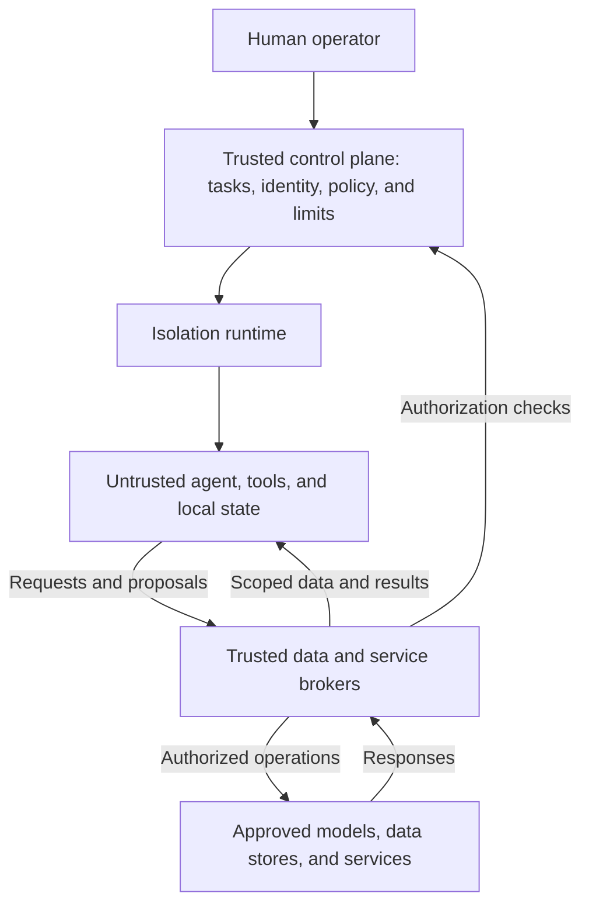

# Calvin specification

An open framework for autonomous agents with authority enforced outside the agent.

Calvin proposes a way to give agents useful access to tools, data, persistent
memory, and external services within explicit limits. Operators should be able to
combine and replace components from different open-source projects, commercial
vendors, and their own services while preserving the system's security contracts.

This repository holds the architecture proposal and will develop into the
specification. The work is at the design stage. Interfaces are conceptual, deployment profiles
need implementation evidence, and there is no stable specification or runnable
reference implementation here yet.

## Why Calvin

Execution isolation is one part of agent containment. An agent also needs rules
for which data it can read, which recipients can receive that data, which actions
it can perform, and how much it can spend. Keeping credentials outside an agent
does not, by itself, prevent misuse of authorized services or disclosure through
permitted requests.

Prompt injection in documents, messages, or tool responses can redirect an agent.
Memory poisoning can preserve malicious instructions across runs. Malicious
dependencies or compromised tools can execute arbitrary code inside the guest.

Calvin's design assumes the complete agent environment can be compromised,
including the harness, tools, local memory, root privileges, and guest kernel.
Its governing principle is:

> The sandbox can request or propose. Trusted external components establish
> identity, authorize operations, and perform external effects.

Agents own their reasoning and workflow. They can investigate, plan, code, test,
and coordinate autonomously within a human-authorized task. Trusted controls
outside the guest enforce data access, operations, recipients, expiration,
delegation, and cumulative budgets. Standing policy can permit routine actions
automatically. Human approval and independent validation apply where the selected
effect policy requires them.

## Read the architecture proposal

Start with [Calvin Architecture](research/architecture.md).
It covers goals, the threat model, component responsibilities, conceptual
interfaces, workflows, and open decisions. It is design research, not a normative
specification or evidence of implementation security.

For a shorter first pass, read the architecture's
[purpose](research/architecture.md#1-purpose-and-governing-principle),
[goals](research/architecture.md#2-project-goals), and
[end-to-end workflows](research/architecture.md#27-end-to-end-workflows).

## Repository structure

The initial contents are:

```text
spec/
├── README.md
├── CONTRIBUTING.md
└── research/
    └── architecture.md
```

`research/` holds architecture proposals and supporting studies. Their status and
assumptions remain explicit. Add the following directories as their contents
appear:

| Path | Purpose |
| --- | --- |
| `proposals/` | Numbered design proposals and recorded decisions. |
| `specification/system/` | Required shared behavior, security requirements, and failure handling. |
| `specification/components/` | Required behavior for each component role. |
| `contracts/` | Machine-readable schemas and protocol bindings. |
| `profiles/` | Deployment configurations and the guarantees each must provide. |
| `conformance/` | Requirements, test cases, coverage criteria, and evidence requirements. |
| `implementations/` | Implementation listings and conformance evidence for specific versions and configurations. |

The specification defines required behavior. Contracts define the representations
that implementations exchange. Profiles select a deployment's required guarantees.
Conformance defines the evidence needed to support a claim. Keep these distinctions
explicit as the specification develops.

## Design overview



This sketch shows logical roles. A broker is a trusted component that mediates
data access or performs an operation within its assigned authority. Components
outside the guest can run locally or remotely. Their placement must preserve the
chosen trust boundaries.

The proposed contracts cover:

- Human-defined tasks, bounded runs, expiring grants, revocation, and cumulative
  resource and spending limits.
- Persistent agent identities and scoped memory. Specialists with different
  data or authority use separate security domains. Delegating work does not
  automatically grant access to its inputs or results.
- Workspace, network, credential, model, and service brokers. Host-managed
  credentials stay outside the guest. Inference routes identify approved models,
  accounts, data-handling assumptions, usage, and costs.
- External actions bound to exact content, parameters, resources, recipients,
  and current-state conditions. Policy selects required inspection, validation,
  and human review before execution.
- Protected audit records that distinguish authorization, attempts, observed
  results, and uncertain outcomes across retries and failures.

Calvin names the whole project. The framework is intended to support
coding agents, persistent personal assistants, and specialist teams, across
compatible agent harnesses and model providers.

## From proposal to specification

The planned deliverables are shared component contracts and deployment profiles,
an incremental reference implementation, adapters for existing systems, and
executable conformance tooling. Stable contracts should follow demonstrated
behavior and independent integration experience.

The proposed starting point is:

1. Demonstrate one isolated agent and one human-authorized task, with bounded
   execution, scoped memory, an approved inference route, and one typed external
   action. A source-to-PR or mailbox-thread-to-reply flow can exercise this core.
2. Replace one component with an independent implementation. Test ordinary
   operation, adversarial failures, retained state, and retirement of old authority.
3. Demonstrate a coordinator and a specialist in separate security domains,
   with bounded delegation and restricted result access.

Conformance evidence must identify the component and specification versions,
deployment profile, configuration, tested combination, coverage, and limitations.
Compatible APIs and passing component tests alone do not establish the security
of a complete deployment.

Normative requirements will have stable identifiers that tests can cite. Resolve
disagreements between tests and the specification explicitly. Reference
implementation behavior does not silently become the standard. Version the
specification, test suite, and implementations independently.

The design also has explicit limits. An approved model provider is a recipient
of task data, and its data handling remains a deployment assumption. An agent
that can read private data and publish arbitrary content can disclose that data
through a permitted action. Isolation, scanners, and validation do not prove
that every authorized action is harmless.

## Contributing

See [CONTRIBUTING.md](CONTRIBUTING.md) for design discussions, document changes,
and integration proposals.

## Background

Calvin is named after [Susan Calvin](https://en.wikipedia.org/wiki/Susan_Calvin),
Isaac Asimov's fictional robopsychologist.

Calvin grows out of [Agent Sandbox](https://github.com/mattolson/agent-sandbox),
a project for running coding agents in a local sandbox with restricted file and
network access and proxy-side credential injection. Calvin rethinks that design
as a broader framework with replaceable components and explicit authority and
data-flow contracts.
