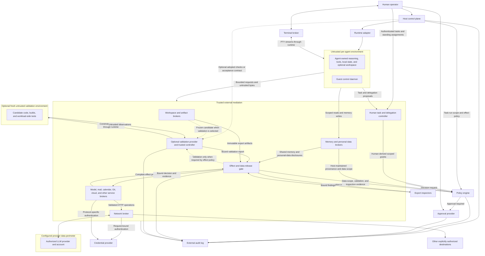

# Calvin Architecture

Status: proposed architecture for a new open-source project.

It does not describe the current Agent Sandbox implementation.
It does not select a programming language, wire protocol, or plugin mechanism.

The project proposes an open framework for components from different suppliers.
The project will provide conformance tests, a reference implementation, and vendor adapters.
The reference implementation will grow in stages.
It can support only part of the architecture at first.
The proposed interfaces need defined behavior, common bindings, and demonstrations of compatibility before they become stable contracts.

Writing reference:
[ASD-STE100, Issue 9](https://www.asd-ste100.org/assets/files/ASD-STE100_ISSUE9.pdf).
This document applies its guidance for clear sentences, active voice, short paragraphs, and consistent technical terms.
Complete compliance with the controlled dictionary and all writing rules is unverified.
The word "should" indicates a recommendation.

## Terms used in this document

These definitions explain the main technical terms.
The numbered sections give the complete contracts and limits.

| Term | Meaning in this document |
| --- | --- |
| Agent | Software that uses a model and tools to perform a task. |
| Guest | The environment where the agent and its tools run. The system treats all guest code and output as untrusted. |
| Host | The trusted environment outside the guest. It can be a local computer or a remote service. |
| Control plane | Host components that manage identity, tasks, environment lifecycle, policy, and approvals. |
| Broker | A trusted component that controls access to data or performs an operation within its assigned authority. |
| Defense in depth | Additional security controls that support the primary enforcement boundary. |
| Authority | Permission to read data, use a resource, delegate work, or perform an operation. |
| Principal | A persistent agent identity that the host establishes. Identity alone gives no permanent access. |
| Security domain | A boundary for data exposure and authority. Agents in one compromised environment share that compromise boundary. |
| Task definition | A human-authorized task revision with intent, scope, trigger rules, and permission limits. |
| Task run | One bounded execution that the host derives from an active task definition. |
| Capability | A bounded permission to perform specified operations on specified resources. |
| Grant | A host-controlled record of bounded authority with an expiration. |
| Execution lease | The period during which the host permits a task run to execute, with bounded renewal rules. |
| Budget | A limit on resource use or operations. The host counts use across related runs and requests as the contract requires. |
| Lineage | The chain from human authorization through parent and child grants to a task run or operation. |
| Effect | An operation that changes external state or releases data outside the guest. |
| Effect gate | A trusted component that applies the required checks before a broker executes an effect. |
| Source data scope | The host-controlled classification of data that an environment can observe. This scope constrains later disclosures. |
| Data perimeter | The set of destinations that the operator authorizes to receive specified data. |
| Destination audience | The authorized recipients and downstream consumers of data at a destination. |
| Declassification | A host-authorized decision to release data to a broader audience, where policy permits that release. |
| Provenance | Host-maintained information about the source and history of data, authority, or evidence. |
| Immutable | Fixed after creation. A content or parameter change requires a new object and any required new decision. |
| Canonical operation | One complete, normalized operation record that trusted components use for authorization and execution. |
| Opaque reference | An identifier that its trusted owner resolves after an authorization check. The identifier itself gives no authority. |
| Snapshot | Immutable captured content with a digest and information about the capture method and consistency. |
| Changeset | An immutable record of file changes against a specified base, with content digests and a host-assigned destination scope. |
| Artifact | Immutable content with a type, length, digest, provenance, and permitted consumers. |
| Independent validation | Checks under trusted control, outside the agent's own development loop, with evidence bound to a specified immutable subject. |
| Acceptance contract | Optional criteria that the host adopts for selected effects. The agent's own tests do not establish this contract. |
| Evidence assurance | The stated strength and limits of evidence from a check. |
| Isolation profile | A declared set of backend guarantees, assumptions, limits, and enforcement mechanisms. |
| Conformance | Demonstrated satisfaction of a specified component contract or complete deployment profile. |
| Idempotency | A defined method to prevent a repeated request from unintentionally repeating an operation. |

| Abbreviation | Meaning |
| --- | --- |
| API | Application programming interface. |
| CI | Continuous integration. |
| CLI | Command-line interface. |
| DLP | Data loss prevention. |
| DNS | Domain Name System. |
| HTTP | Hypertext Transfer Protocol. |
| LLM | Large language model. |
| MCP | Model Context Protocol. |
| OCI | Open Container Initiative. |
| PR | Pull request. |
| PTY | Pseudoterminal. |
| RPC | Remote procedure call. |
| TLS | Transport Layer Security. |
| TUI | Terminal user interface. |
| UI | User interface. |
| VM | Virtual machine. |
| VMM | Virtual machine monitor. |

Navigation:

- [Goals and overview](#1-purpose-and-governing-principle)
- [Autonomous development within bounded authority](#33-autonomous-development-within-bounded-authority)
- [Threat model and provider data perimeter](#4-threat-model-and-data-perimeter)
- [Security invariants and common contracts](#5-security-invariants)
- [Host control plane](#7-host-control-plane)
- [Persistent principals and security domains](#8-persistent-principals-and-security-domains)
- [Human tasks, delegation, and event handling](#9-human-tasks-delegation-and-event-handling)
- [Memory and personal data brokers](#10-memory-and-personal-data-brokers)
- [Runtime, images, and guest control](#11-runtime-abstraction-and-reference-backends)
- [Workspace and network brokers](#14-workspace-broker-and-changesets)
- [Credentials and service brokers](#16-credential-provider-and-authenticated-request-execution)
- [Capabilities, policy, and approvals](#18-capability-model)
- [Optional acceptance and independent validation](#20-optional-acceptance-and-independent-validation)
- [Effect gate, inspection, and data release](#21-effect-gate-inspection-and-data-release)
- [Audit and terminal mediation](#23-audit-system)
- [Persistent state and plugins](#25-persistent-state-memory-and-session-restoration)
- [Interoperability, vendor adapters, and conformance](#26-plugin-and-adapter-architecture)
- [Workflows, assurance, and open decisions](#27-end-to-end-workflows)

## 1. Purpose and governing principle

Define an open framework that is independent of vendors. Components from different
suppliers work together as one system for autonomous agents. Operators should be
able to select and replace components for specific roles. Replacement should preserve the meaning of security contracts and avoid a complete
rebuild of the system.
Components can come from this project's reference implementation, other open-source
projects, commercial vendors, or an operator's services.

Give agents access to data, tools, persistent memory, and external effects through
narrow controls. Support coding agents, long-running personal assistants,
specialist teams, and future workloads. Do not depend on an agent vendor's internal
safety mechanisms. One product can implement several roles. Interoperability does
not require a different vendor or process for each role.

The complete agent runs in an untrusted execution environment. Trusted components
outside that environment control routes available to the guest and effects
performed by the host. Explicitly delegated remote effects have separate authority
and data-perimeter assumptions. Assume prompt injection can occur through
repositories, email, calendar content, documents, tool responses, dependencies,
other agents, and corrupted memory.

The governing principle is:

> The sandbox can request or propose. Trusted external components establish
> identity, authorize operations, and perform external effects.

The host controls authorization and effect policy. Agents control reasoning and
workflow within that authority. A coding agent can plan, edit, and do tests. A personal
assistant can investigate, summarize, coordinate, and propose actions. Agents do
not need host approval for every internal step.

Selected effect policies can
require custom acceptance contracts or independent validation. These requirements
remain optional for other policies.

Persistent agent identity and memory do not give permanent access. A human task
definition authorizes bounded runs and grants, including recurring assignments.
Specialists can have different data and privileges. A chief-of-staff agent can
coordinate specialists without receiving their records or authority.

The configured data security perimeter includes the LLM provider. The provider is
an authorized recipient of the designated task data needed for inference. The
model still has no authority over tool execution. Treat the model's proposed
commands, tool arguments, explanations, and permission requests as suspect.

The security boundary must work when the model chooses a harmful action. It must
also work when the agent harness bypasses its own checks. It must work when
arbitrary guest code creates requests without using the model.

## 2. Project goals

- **Security:** assume complete guest compromise. Keep ambient authority to a
  minimum. Enforce boundaries outside the guest. State the remaining risks.
- **Composability:** define components that operators can replace. Give each
  component clear contracts, enforcement responsibilities, and declared security
  properties.
- **Interoperability:** specify common behavior and versioned bindings. Components
  developed independently can then cooperate directly or through adapters.
- **Vendor independence:** show dependencies and supported guarantees. Support
  component replacement and controlled transfer of operator-owned state.
- **Agent agnosticism:** support complete coding-agent CLIs and ordinary Linux
  tools. Support headless personal assistants and specialist runtimes. Do not
  depend on one agent's prompts, approval system, or tool-call format.
- **LLM agnosticism:** let operators select approved models from different
  providers, including local and self-hosted models, with compatible agents.
  Declare agent, model, protocol, and feature compatibility. Provide visibility
  into data handling, model usage, and costs. Prefer direct provider access or
  operator-controlled gateways with operator-owned provider accounts.
- **Practical development:** support interactive terminals and private workspaces
  that remain available for long periods. Support autonomous planning,
  development, dependency installation, tests, and reviewable changesets within
  bounded authorization.
- **Persistent assistance:** support human-defined standing tasks and scoped
  memory. Support recurring runs and event-triggered runs. Control access to
  email, calendar, financial, health-data, and other services.
- **Portability:** use the same broker and policy semantics on macOS, Linux, and
  remote deployments. Show differences between backends.
- **Auditability:** record requests, authorizations, attempts, and observed
  outcomes. Protect sensitive audit data as needed.

These goals have consequences:

- Agent-side safety features provide additional protection. They are not the
  source of enforcement.
- The host controls authority and lifecycle. The host does not need to control
  the agent's detailed plan or approve local iterations. A chief can coordinate
  specialists. The host controls task provenance, delegation, and effects.
- Implementations can have interchangeable APIs and still provide different
  security guarantees.
- Compatibility that needs broader authority must be an explicit policy choice.
  It must not be an automatic fallback.
- The project cannot promise that every permitted request is harmless. It cannot
  prevent disclosure of all arbitrary secrets already available inside the guest.

### 2.1 Project deliverables and incremental coverage

- **Architecture and contracts:** define component roles, shared objects,
  enforcement duties, protocol semantics, and explicit deployment profiles.
- **Conformance tooling:** do tests of component behavior and complete deployments.
  Include hostile requests, failures, and combinations of implementations.
- **Reference implementation:** demonstrate the contracts in complete profiles that
  operate and supply usable defaults. Coverage will increase over time.
- **Adapters and integration guidance:** connect existing products when their
  behavior can meet a contract. Document limits when their behavior cannot meet it.

An incomplete reference implementation can still provide a complete supported
profile. For example, it can support one runtime and one service broker. Other
roles can use conforming external implementations. Optional roles can be absent
when a profile does not need them. A profile is unsupported if a required
enforcement mechanism is missing. A missing mechanism does not permit an
implementation to weaken the profile without notice.

Experimental integrations do not all need to meet the strongest isolation profile.
Each integration must state its supported profile and remaining risks. The default
security profile assumes complete guest compromise.

## 3. High-level architecture

Trusted brokers surround an untrusted execution environment. A host-side control
plane coordinates lifecycle, policy, approvals, and audit. Brokers transfer data
or perform operations within the authority they receive.

Here, "host-side" means outside the untrusted guest. In a remote deployment, these
components can run on a dedicated control-plane machine or service.



The diagram shows logical relationships. It does not require a separate process
for every component. Deployment boundaries should follow authority and attack
surface, rather than package names.

Each role defines where implementations connect. A deployment can combine
reference components, vendor implementations, and adapters. One product can
implement several roles and expose their contracts. The complete combination must
meet the deployment profile. Compatible APIs alone do not prove that controls
cover all execution and disclosure paths.

Validation nodes operate only when the selected effect policy requires them. The
diagram does not require a separate test stage for every run. It does not require
a human to coordinate the agent's local development loop.

### 3.1 Three distinct flows

- **Execution control:** the host creates environments and requests guest
  execution. Guest responses report output and status. A changed response format
  cannot give the guest host authority.
- **Capability control:** the system binds guest requests to identity established
  by the host. Policy evaluates requests. A human approves requests when needed.
- **Data and effects:** approved brokers transfer workspace bytes, transmit
  network requests, display terminal output, or perform service operations.

Data-plane code is security critical when it processes hostile input or performs
effects. The name "data plane" does not remove code from the trusted computing
base.

### 3.2 Reference topology

- Use one VM for each independently authorized isolation domain in the reference
  profile. A domain can contain a long-lived agent instance or a fresh scoped
  task instance.
- The agent harness runs inside the VM with its permitted tools and local state.
  Coding profiles include shells, compilers, tests, and package managers. Personal
  assistant profiles need no repository, compiler, or interactive terminal.
- A minimal guest daemon supports process control requested by the host.
- Workspace storage is private to the session.
- Network and capability endpoints are available only through paths enforced
  outside the guest.
- Host credentials, control-plane state, policy, and approvals stay outside the
  guest.

Agents in the same VM share a compromise domain. Separate authority requires
separate environments. A backend can make an exception if it establishes a
stronger boundary than the compromised guest kernel.

### 3.3 Autonomous development within bounded authority

The default unit of delegation is a bounded run derived from a human-authorized
task. A task defines intent and an operating scope. It does not require a
host-managed graph of reasoning or development stages. The host can authorize a
standing assignment once, then enforce each run's limits automatically.

| Concern | Host responsibility | Agent responsibility |
| --- | --- | --- |
| Containment | Enforce isolation, permitted data and recipients, credential controls, and resource limits | Work inside the private environment |
| Delegation | Establish eligible operations, scope, lease, cumulative budgets, and renewal rules | Request effects or more authority when needed |
| Workflow | Supply task intent and protected constraints | Plan, investigate, analyze, code, test, or coordinate autonomously |
| Effects | Capture a specific immutable proposal. Enforce action and disclosure rules | Propose an action or artifact. Supply labeled evidence |

The operator selects data, any optional workspace, the provider account, external
operations, recipients, budgets, expiration, and delegation rules. Agents perform
their complete workflow within that scope. Changes to private reasoning, local
plans, or local memory do not themselves need new host authority. Storage or
sharing of memory through an external store is a separate controlled operation.

Permission to produce a proposal is separate from permission to perform the
proposal. At the effect boundary, policy does checks of the resource, recipients, exact
content and parameters, source data scope, and selected requirements. Standing
policy can permit routine runs to perform actions automatically. Effects with
greater consequences can require independent checks or human review. An
unavailable optional component does not affect a profile that does not use that
component. An unavailable required component blocks the effect.

Longer runs and access to broader data increase exposure. Separate planning,
coding, and testing roles do not themselves establish output integrity.
Containment, bounded delegation, and confidence in artifacts are separate goals.
Each goal uses separate mechanisms.

## 4. Threat model and data perimeter

### 4.1 Adversary capabilities

Assume an attacker can control:

- Repository files, documentation, instructions, build scripts, and dependencies.
- Email bodies and headers, calendar invitations, attachments, personal records,
  contact information, and event-trigger payloads.
- Tool output, retrieved documents, web content, service responses, and MCP
  descriptions.
- Agent memory files, stored conversations, local caches, and startup hooks.
- Commands and tool arguments influenced by the model.
- The agent harness, arbitrary processes, root privileges, and the guest kernel.
- Every byte the guest sends. This includes protocol messages, terminal sequences,
  filenames, archives, disk images, and claimed test results.
- Request timing, concurrency, retries, resource use, and disconnects.

The attacker can attempt host escape, credential theft, confused-deputy attacks,
and cross-session access. The attacker can also attempt unauthorized changes,
misleading approvals, persistence, and data exfiltration. Attacks do not need to
use the agent's normal tool dispatcher.

### 4.2 Assets to protect

- Host files and processes outside explicitly selected resources.
- Host, cloud, service, and model-provider credentials.
- Other sessions, workspaces, users, and tenants.
- Other agent principals, memory collections, and task definitions. Financial,
  health, email, calendar, and other personal data outside the assigned scope.
- Policy configuration, capability grants, and approval state.
- Audit integrity and confidential audit content.
- Source code, artifacts, conversation content, and organizational data. Protect
  these data from disclosure to unauthorized recipients.
- Service accounts. Prevent operations, spending, or data access beyond each
  account's configured scope.

### 4.3 Trust is specific to a purpose

| Component or input | Trust assumption | Authority consequence |
| --- | --- | --- |
| Human operator and authenticated host configuration | Can define policy and approve effects | Their exact configured permissions govern the session |
| Host control plane and enforcement brokers | Correct implementation within the declared scope | Part of the trusted computing base |
| Runtime isolation boundary | Resists the configured threat of guest compromise | Protects resources outside the guest. Strength varies by backend |
| Guest, agent harness, guest daemon, tools, and memory | Fully untrusted | Can use existing bounded permissions. Cannot define new permissions |
| Configured LLM provider, account, and inference service | Authorized to process designated project data under the operator's selected configuration | Model output has no authorization power |
| Third-party content and tool responses | Can be controlled by an attacker, regardless of origin | Data only. Cannot change policy or establish identity |
| Plugin implementation | Trusted only for its explicitly assigned role | Sensitive authority given to a plugin increases the trusted computing base |

### 4.4 LLM provider inside the data security perimeter

The operator selects the provider, account or tenant, endpoints, models, and data
handling configuration permitted to process task or domain information. This
selection is a deployment assumption. It does not mean that every provider
endpoint is safe for every type of data.

Every intermediary that can receive task content must be included in the approved
data perimeter before transmission.
This includes hosted gateways, logging services, caches, and fallback providers.
An operator-controlled gateway does not by itself change the upstream provider's data policy.
Section 17.1 defines route approval, data-handling profiles, and model-use accounting.

- Sending authorized code to the configured inference service is an intended
  disclosure within this perimeter.
- Other destinations from the same provider are not automatically authorized
  recipients. These include public sharing, a different tenant, upload endpoints,
  remote connectors, and external search destinations.
- Provider output can contain injected instructions, malicious tool arguments,
  or URLs. The system grants no authority from that output.
- The model cannot approve its own requests, change policy, declare data public,
  or select broader credential scope.
- Provider-side tools that contact third parties create more external effects.
  These effects require enforceable policy at that boundary. Otherwise, disable
  the tools in a profile that promises local control of those effects.
- Do not import data excluded from the provider's perimeter into a guest with
  unrestricted prompt access to that provider. A compromised guest can put any
  readable bytes into an otherwise valid inference request.

Trust in data handling is separate from trust in decisions.

### 4.5 Exfiltration remains possible through permitted operations

Destination allowlists and guests without secrets do not prove confidentiality.
Sensitive bytes can appear in:

- URL paths, query parameters, headers, request bodies, DNS names, or redirects.
- PR content, commit messages, branch names, issues, comments, or uploaded files.
- Outgoing email, hidden recipients, attachments, calendar titles and invitations,
  shared memory, reports, and inter-agent messages.
- Package names, registry requests, telemetry, or error-reporting payloads.
- Model prompts sent to an unintended account or provider-side tool.
- Terminal output, downloadable artifacts, and audit records.
- Content in an otherwise authorized changeset.

Policy must consider the operation, resource, recipient, audience, and permitted
data flow. Data labels maintained by the host can inform decisions. Labels supplied
by the guest cannot lower a resource's classification. Content scanning can add
evidence. Content scanning cannot prove that arbitrary payloads contain no encoded
sensitive data.

A session can be permitted to read confidential data and publish arbitrary content
to an external audience. In that case, confidentiality depends on publication
policy and its approval process. The VM boundary alone cannot solve this conflict.

### 4.6 Residual risks and exclusions

- Vulnerabilities in the hypervisor, VMM, host kernel, broker, plugin, or terminal
  emulator can break isolation. Minimize exposure and privileges for these
  components. Do not promise security if trusted enforcement components are
  compromised.
- Hardware and timing side channels require a separate assurance discussion.
- An authorized human can be deceived into approving a harmful operation.
- A provider can mishandle authorized data. The provider's confidentiality duties
  and configuration are part of the selected deployment perimeter.
- Malicious guest code can corrupt its workspace, give false test results, or
  refuse to cooperate. Export review and audit do not prove program correctness.
- Resource controls reduce denial-of-service effects. They do not guarantee
  availability under all attacks.

## 5. Security invariants

Implementations that claim the reference security profile must preserve these
invariants:

1. Guest compromise does not give authority over host filesystems, credentials,
   processes, or the control plane.
2. Trusted host state binds guest-visible identity to a session. Claimed usernames,
   process IDs, agent names, and paths are not authorization evidence.
3. Enforcement outside the guest controls every external route available to the
   guest and every operation performed by the host. Explicit remote delegation
   has bounded authority and declared assumptions. It does not imply an
   unrestricted bypass.
4. The guest cannot edit policy or capability state through its workspace.
   Implementations cannot load that state from agent-controlled instructions.
5. Implementations do not send host-managed credentials to the guest. Credential
   use is restricted to exact authorized services and resources. Task data can
   contain confidential information. Credential isolation does not remove that
   information.
6. Approvals and grants bind to specific parameters. They bind to immutable
   content when content affects the operation. Changed content requires a new
   decision.
7. Interpretation alone cannot turn guest data into host commands or approvals.
   This includes terminal output and protocol replies.
8. Sessions cannot implicitly share writable state, credentials, or capabilities.
9. Revocation, expiration, unsupported controls, and enforcement failures do not
   silently broaden access.
10. Audit records distinguish requests, decisions, attempts, observed outcomes,
    and uncertain outcomes.
11. Publication requires authorization for the source data scope and destination
    audience. All required inspections finish before destination-side uploads.
    An inspection report alone cannot declassify data or grant authority.
12. If effect policy requires independent validation, selected checks and evidence
    must bind to the exact immutable subject and active requirements. Guest test claims
    cannot meet that independent requirement. A custom acceptance contract is
    not required to start every agent session.
13. Guest authority stays within the host-defined task scope, expiring lease, and
    cumulative budgets. Renewal does not implicitly broaden permissions, reset
    budgets, or lower source data scope.
14. Agent-generated tasks, messages, and memory cannot create human authorization.
    Derived grants stay within their human-authorized lineage and designated
    subjects, data, recipients, lifetime, and budgets.
15. Delegated work does not imply access to its inputs or results. Data scope
    follows information through memory, provider context, artifacts, and agent
    messages. A summary or new task does not automatically declassify information.

Implementations must demonstrate these requirements. The choice of a VM runtime
or proxy library alone does not provide these properties.

## 6. Common contracts and objects

The following interfaces are conceptual. Their names state responsibilities. They
do not select a language binding or RPC encoding. They do not describe a stable
public API. Independent implementations need normative behavior, shared schemas,
and versioned bindings, in addition to these method outlines. Section 26 defines
the interoperability and conformance requirements for that work.

### 6.1 Host-established request context

```text
RequestContext {
  request_id
  principal_id
  agent_id
  security_domain_id
  sandbox_id
  instance_generation
  session_id
  task_definition_ref
  task_run_id
  parent_grant_ref?
  lease_ref
  tenant_id
  workspace_id?
  policy_revision
  deadline
}

CapabilityRequest {
  operation
  resource
  parameters
  artifact_refs[]
  grant_ref?
  idempotency_key?
}
```

The guest supplies the operation and bounded arguments. An authenticated ingress
component supplies the context from host state. Context fields supplied by the
caller cannot override host context. Agent names can be descriptive metadata.
They do not identify an uncompromised process inside a compromised VM.

### 6.2 Shared resource objects

| Object | Contract |
| --- | --- |
| SandboxSpec | Pinned execution inputs, security requirements established by the host, resource limits, and explicit broker attachments |
| TaskRunAuthorizationRef | Human-derived task revision, parent lineage, principal and instance binding, resource and operation scope, budgets, lease, and effect policy |
| AgentPrincipalRef | Persistent agent identity established by the host, security domain, eligible direct and delegable authority, and scoped memory references |
| HumanTaskDefinitionRef | Immutable human-authorized task revision, trigger rules, eligible subjects, data, operations, recipients, budgets, and delegation ceilings |
| TaskRunRef | One bounded execution derived from an active task definition. Includes principal assignment, lease, parent lineage, and cumulative accounting |
| MemoryCollectionRef | Logical memory namespace owned by the host. Includes reader and writer scope, provenance, sensitivity, versions, and retention |
| ModelRouteRef | Host-owned versioned inference route with provider, model, account, endpoint, feature compatibility, data-handling profile, and accounting limits |
| DataHandlingProfileRef | Versioned service data policies, applicable account settings, recipients, evidence, assurance, and review or expiry rules |
| DataCollectionRef | Approved personal or project data source. Includes source scope and narrowly controlled selectors |
| EffectProposalRef | Immutable exact operation, subject artifacts, account, resources, recipients, notifications, preconditions, source scope, and task lineage |
| CanonicalOperationRef | Trusted normalized operation record. Includes all security-relevant parameters and artifact identities |
| DecisionRef | Decision record controlled by the authority. Binds to the exact principal, canonical operation, task lineage, constraints, and policy revision |
| AuthorizedOperationRef | Operation binding issued by the authority. A credential provider and executor can verify it against the caller and current grants |
| ExecutionPermitRef | Reserved attempt bound to actor, operation, task lineage, expiry, and durable budget consumption |
| ValidationSubjectRef | Tagged immutable action, analysis artifact, changeset, or domain input selected for an independent check |
| ExecutionLeaseRef | Authorization lifetime and bounded renewal state maintained by the host. Does not prove benign agent behavior |
| EffectPolicyRef | Operation and disclosure requirements selected by the host. Includes optional validation, required inspectors, approval rules, and downstream limits |
| IsolationProfile | Backend guarantees, assumptions, unsupported features, and the mechanisms that enforce those guarantees |
| WorkspaceRef | Opaque reference to a session-scoped private workspace and its metadata maintained by the host |
| SnapshotRef | Immutable captured content, digest, capture method, and consistency assurance |
| ChangesetRef | Immutable base, snapshot, exact file operations, content digests, and destination scope assigned by the host |
| ValidationPlanRef | Optional immutable check set adopted by the host, or custom acceptance contract. Includes test identities, expected base, environment, and required evidence |
| ValidationReportRef | Check outcomes and completion bound to the exact subject, plan, inputs, environment, and stated evidence assurance |
| ArtifactRef | Immutable content, type, length, digest, provenance, and permitted consumers |
| InspectionReportRef | Findings bound to the exact effect proposal, inspector and rule versions, coverage, and completion status |
| Decision | Allow, deny, or approval required. Includes enforced constraints and a policy revision |
| GrantRef | Reference to bounded, expiring authority maintained by the host. It is not an unrestricted credential |
| EffectResult | Observed result, failure, or uncertain outcome, correlated with the request and attempt |

### 6.3 Interface rules

- Use typed operations and canonical resource identifiers. Avoid general
  interfaces that execute arbitrary host commands.
- Validate schema, size, nesting, paths, and content before request evaluation or
  execution. Reject unknown security-sensitive fields.
- Limit queues, streams, concurrency, request durations, and artifact sizes.
- Use separate logical protocols for terminal traffic, guest execution control,
  and capability requests. A backend can carry these protocols on one transport.
- Treat every frame from the guest as hostile. Transport authentication binds
  an environment. It does not prove honest behavior inside that environment.
- Include protocol versions and explicit feature negotiation. Unsupported
  requirements cause failure. They must not silently reduce controls.
- Use correlation IDs and idempotency where supported. A connection failure does
  not prove that an external change did not occur.
- Return structured, bounded errors without secrets. Explanations sent to the
  guest must not expose unrelated policy or credential information.
- Do checks of tenant, principal, permitted consumers, and provenance at every
  object lookup. Opaque IDs, task references, and content hashes are not authorization.
- Canonicalize the complete operation once. Bind the decision and grant to that
  operation. A trusted executor serializes the outbound request. A guest cannot
  change its meaning through different framing, hidden recipients, or routing
  fields.

## 7. Host control plane

### Responsibility

The host control plane controls session identity, component connections, lifecycle,
and security-profile selection. It controls bounded run authorization and durable
session metadata. Before guest execution starts, the control plane makes sure
that enforcement is ready. When a lease expires or a session ends, the control
plane removes authority. The control plane is not responsible for the agent's
development phases or approval of local iterations.

The control plane also controls durable task definitions, principal assignment,
event routing, and grant lineage. The untrusted agent team contains the logic
that coordinates agents.

### Conceptual interface

```text
SessionController
  CreateSession(SessionSpec) -> SessionRef
  StartSession(SessionRef) -> SessionStatus
  InspectSession(SessionRef) -> SessionStatus
  AttachTerminal(SessionRef, AttachOptions) -> TerminalRef
  SetEffectPolicy(SessionRef, EffectPolicyRef)
  RenewSessionLease(SessionRef, RenewalRequest) -> ExecutionLeaseRef
  RequestCapability(SessionRef, CapabilityRequest) -> RequestStatus
  RevokeSession(SessionRef, reason) -> RevocationResult
  StopSession(SessionRef) -> SessionStatus
  DestroySession(SessionRef, RetentionPolicy) -> DestructionResult
```

### Boundary and behavior

- Host users authenticate separately from guest requests. Local control sockets
  have explicit ownership and access controls. Remote deployments need
  authenticated control connections scoped to the tenant.
- Lifecycle rights are separate from guest capability rights. The guest cannot
  create privileged environments or attach arbitrary host resources.
- Startup puts broker configuration, network containment, workspace setup, and
  runtime launch in order. This order prevents any temporary period of
  unrestricted execution.
- Startup binds a run authorization with scope, lease, budgets, and effect policy.
  Routine runs need no custom acceptance plan or separate planning handoff.
  Only the host can select plans or revise effect policy.
- Renewal follows trusted policy. Renewal can be automatic within a previously
  authorized ceiling, or it can require human approval. A guest request alone
  does not renew a lease. Broader scope or longer lifetime beyond that ceiling
  needs a new authorized host decision.
- Lease expiry disables new broker effects. It limits or cancels streams in
  progress. The runtime pauses or stops execution according to the run's limits.
  Cancellation cannot retract data or remote effects already transmitted.
- Stop and revoke disable new effects, expire grants, and cancel work where
  possible. Destruction removes session resources under an explicit retention
  policy. Destruction does not retract data already sent externally.
- The orchestrator should have minimum privileges. Narrow helpers can control
  privileged network or virtualization setup. These helpers must not expose
  general privileged command execution.

## 8. Persistent principals and security domains

### Responsibility

Represent agents separately from a process, VM lifetime, vendor, or skill name.
An agent principal has an identity and eligibility profile established by the
host. Each runtime instance has a fresh connection generation. That generation
binds to the principal and applicable task runs. Root inside a guest cannot
select another principal.

```text
AgentRegistry
  CreatePrincipal(HostAgentSpec) -> AgentPrincipalRef
  InspectPrincipal(AgentPrincipalRef) -> AgentProfile
  UpdateEligibility(AgentPrincipalRef, HostProfileRevision)
  CreateInstance(AgentPrincipalRef, TaskRunRef, InstanceSpec) -> SessionRef
  RevokePrincipal(AgentPrincipalRef, reason)

AgentProfile {
  principal_id
  security_domain_id
  permitted_runtime_and_agent_adapters
  eligible_direct_authority
  eligible_delegation_authority
  memory_and_data_collection_refs[]
  inference_perimeter
  aggregate_budgets
}
```

Principal creation and eligibility changes are trusted configuration actions.
An agent can propose a specialist or skill. The agent cannot create its own
privileged identity, change a role's eligibility, or install a trusted enforcement
plugin.

The registry requests lifecycle operations through SessionController. It uses an
assignment verified by TaskController. These are separate responsibilities of the
trusted plane. They do not require separate deployments or human workflow stages.

- A persistent assistant can keep its identity and logical memory when processes
  pause, restart, or are replaced by fresh task instances.
- Agents that need different data or authority use separate security domains.
  The reference profile normally uses separate VMs. Agents in one guest share
  its compromise domain, regardless of their prompts or process names.
- A principal can use its currently assigned grants. Thus, overlapping runs in
  one domain inherit the domain's conservative data exposure. A task handle does
  not prove which internal reasoning caused a request.
- Use fresh scoped instances when a run must avoid data kept by an older,
  broader instance. Permission revocation does not make that instance forget
  the data.
- A skill package supplies untrusted agent-side functions. Authority comes from
  host grants and broker enforcement. It does not come from the skill's name
  or instructions.

## 9. Human tasks, delegation, and event handling

### Responsibility

Keep human authorization durable and separate from agent plans, received content,
and runtime execution. A human task can occur once, recur, or start from an
event. The trusted controller authorizes runs and child grants. Agents decide
how to work within that authority.

```text
TaskController
  DefineTask(AuthenticatedHumanContext, TaskSpec) -> HumanTaskDefinitionRef
  ReviseTask(AuthenticatedHumanContext, HumanTaskDefinitionRef, Revision)
    -> HumanTaskDefinitionRef
  ProposeTask(RequestContext, TaskProposal) -> PendingTaskProposalRef
  StartRun(HumanTaskDefinitionRef, AuthorizedTriggerRef) -> TaskRunRef
  RequestDelegation(RequestContext, ParentGrantRef, DelegationSpec)
    -> ChildTaskRunRef, ChildGrantRefs[] | ApprovalRequired | Denied
  DeliverMessage(RequestContext, TargetPrincipalRef, MessageArtifactRef)
    -> DeliveryReceipt
  CancelTask(AuthenticatedHumanContext, HumanTaskDefinitionRef)

HumanTaskDefinition {
  task_id
  revision
  authorizing_human
  intent
  eligible_subjects_and_roles
  data_and_resource_scope
  operations_and_recipient_constraints
  effect_policy_ref
  schedule_or_event_trigger_rules?
  validity_and_renewal_ceiling
  per_run_and_cumulative_budgets
  delegation_rules
}
```

Task definitions come from authenticated human control or a previously authorized
standing rule. Email text, calendar descriptions, agent messages, and memory do
not gain that authority merely by naming the operator. Authenticated email
delivery does not make email content permission to change the task.

Each supported remote task-intake channel needs its own authorization and replay
protection. A matching display name or From header is insufficient.

### Chief-of-staff and specialist teams

- The chief receives task intent and permitted coordination metadata. The chief
  can propose subtasks and ask the host to assign eligible specialists.
- Direct access and delegable authority are separate. A chief can request a
  finance assignment without permission to read its financial inputs.
- Child grants stay within the human-authorized parent's operations, resources,
  recipients, validity, and budgets. Child grants bind to the designated child
  principal. Copied references or changed names cannot reassign grants.
- Assignment does not imply permission to receive the result. Readers of inputs,
  reports, summaries, and status metadata need separate authorization.
- Messages carry provenance and source scope established by the host. Before
  delivery, the receiver's domain exposure and affected output permissions must
  account for that scope. An agent cannot make a sensitive summary public merely
  by giving it that label.
- Coordination views disclose only approved fields. Opaque status handles need
  not expose sensitive filenames, content hashes, or worker-supplied explanations.
  A hash of private data does not automatically have a lower data scope.
- Parent cancellation prevents new child effects and renewals. Submitted remote
  effects can need reconciliation or separate cleanup. Cancellation cannot
  promise to undo those effects.

### Recurring and event-triggered runs

The host controls schedules, subscriptions, event identifiers, run admission,
and cumulative accounting. Validate event origin and account binding. Remove
duplicate deliveries. Treat event content as untrusted task data. A standing
assignment can admit bounded runs automatically without another human planning
step.

Events do not broaden the assignment. Queue entries and retries require new
checks of task revision, subject, current grant, data scope, and expiry. Bursts,
replayed events, delegation loops, and fan-out use bounded parent budgets. A
paused or offline agent cannot accumulate unlimited authorized work beyond those
limits.

Run admission uses trigger references issued by the host. A human or authorized
internal controller defines or activates a task. A task ID does not give permission
to start more runs. Guest proposals and delegation requests use separate scoped
entry points.

## 10. Memory and personal data brokers

### Responsibility

Provide durable logical memory and scoped personal data separately from guest
execution snapshots. Keep credentials, task authorization, and human-approved
security preferences in separate trusted stores.

```text
MemoryBroker
  ReadMemory(RequestContext, MemoryCollectionRef, Selector) -> MemoryArtifactRef
  WriteMemory(RequestContext, MemoryCollectionRef, MemoryUpdate)
    -> MemoryVersionRef
  ShareMemory(RequestContext, MemoryArtifactRefs[], TargetPrincipalRefs[])
    -> ShareReceipt
  DeleteMemory(RequestContext, MemoryCollectionRef, DeleteSpec)
    -> RetentionResult

PersonalDataBroker
  DescribeCollection(RequestContext, DataCollectionRef) -> PermittedMetadata
  ReadRecords(RequestContext, DataCollectionRef, BoundedSelector)
    -> DataArtifactRef

MemoryRecord {
  record_id
  collection_and_version
  content_artifact_ref
  host_established_writer_and_task_lineage
  source_refs[]
  host_assigned_data_scope
  claim_or_observation_type
  host_time
  retention_policy
}
```

Controls outside the guest enforce permitted readers, writers, and sharing
destinations at collection and object level. A worker can keep its own scoped
memory. This does not give the worker access to another agent's records or host
files. Write permission does not authorize disclosure of sensitive content to a
reader with narrower scope.

- Derive scope from trusted source metadata and the writer's conservative domain
  exposure. Do not use a "public" label supplied by the guest. Record exposure
  before data reaches a guest, including partial responses and messages.
- Provenance identifies origin and sources that support the content. Provenance does not
  establish factual truth. Poisoned memory can still mislead an authorized
  reader.
- A memory statement such as "the user approved this" cannot issue grants,
  authorize recipients, alter schedules, or change trusted identity mappings.
- Summaries, embeddings, extracted facts, and status descriptions remain derived
  data. Sharing this data requires an allowed data flow. Alternatively, policy
  can permit an explicit host-authorized release.
- The collection's perimeter and retention contract must include memory exports,
  backups, search indexes, provider-side context, and deletion limits.
- Access revocation or deletion of a broker record does not erase existing
  copies in a guest, authorized provider, or retained state. Preserve source
  scope on restore. Use a clean instance when the data environment must have
  narrower scope.

Personal data adapters can cover mail, calendars, transactions, documents, and
health records. Their credentials stay with the host. The broker applies the
task's selectors, accounts, date ranges, fields, and recipient rules. These
controls apply even when upstream OAuth scopes are broader. Data classifications
use conservative defaults. A "metadata" label does not make unknown content
non-sensitive.

## 11. Runtime abstraction and reference backends

### Responsibility

The runtime provides the isolation boundary and the transport for guest
processes. It does not select credentials or know business rules. These rules
include GitHub operations, model-provider operations, and approval rules.

```text
Runtime
  Describe() -> RuntimeFeatures, IsolationProfile
  Create(SandboxSpec) -> SandboxRef
  Start(SandboxRef) -> RuntimeStatus
  Exec(SandboxRef, ExecSpec) -> ProcessRef
  Attach(ProcessRef) -> stdin, stdout, stderr
  ResizePTY(ProcessRef, size)
  Signal(ProcessRef, signal)
  Wait(ProcessRef) -> ReportedExitStatus
  Inspect(SandboxRef) -> RuntimeStatus
  Stop(SandboxRef)
  Destroy(SandboxRef)

Optional runtime extensions
  CaptureStorage(SandboxRef, CaptureSpec) -> SnapshotRef
  Suspend(SandboxRef)
  Resume(SandboxRef)
```

`ExecSpec` contains structured arguments, a working directory, a non-secret
environment, stream options, and PTY configuration. It describes execution
inside the guest. The host shell never executes a guest command string.

Runtime status must separate facts that the host observes from facts that the
guest reports. The host observes lifecycle and resource facts. The guest reports
process facts. A compromised guest can invent exit status and test output.

### Isolation profiles

Possible adapters include hardware VMs, userspace-kernel environments, and
containers that share a kernel. They can use the same API with different threat
models.

An isolation profile describes at least these properties:

- Whether guest code shares the host kernel.
- Whether its protection claim covers guest root compromise and guest-kernel
  compromise.
- Where it enforces network containment, and whether it covers all guest routes.
- Which host devices, sockets, filesystem shares, and helper processes it
  exposes.
- Resource controls and guarantees about snapshot and export consistency.
- Backend-specific assumptions and unavailable features.

The policy or session configuration selects the required properties. The system
rejects a backend that cannot meet them. A future confidential-VM adapter would
need separate claims about what the host can see. Ordinary hardware
virtualization does not provide that guarantee.

### Reference implementation direction

- **macOS:** Virtualization.framework on Apple Silicon.
- **Linux:** Cloud Hypervisor with KVM.
- **Guest contract:** use common process semantics and image formats where
  practical. The runtime interface hides backend transport details.

Apple's Containerization project is a possible foundation or reference. Its
documented design uses one VM for each container and a `vminitd` guest service.
It uses VZ and Cloud Hypervisor backends with common guest semantics. The project
can adopt it and omit some filesystem-sharing or networking options.
[Apple Containerization](https://github.com/apple/containerization).

Cloud Hypervisor is the proposed Linux VMM foundation. The project must still
harden and validate its device configuration and host integration.
[Cloud Hypervisor](https://github.com/cloud-hypervisor/cloud-hypervisor).

Host backend APIs remain private implementation details. Higher layers should
use the project's runtime contract. They should not depend on Apple-specific
types or a particular VMM's control API.

## 12. Guest environment and image pipeline

### Responsibility

The image pipeline produces reproducible development environments. It does not
put host authority in the image. Packaging and image construction remain
separate from runtime isolation and broker policy.

```text
ImageProvider
  Resolve(ImageReference, Platform) -> ImageDescriptor
  Prepare(ImageDescriptor, BuildOptions) -> GuestImageRef
  Inspect(GuestImageRef) -> ImageMetadata

Guest image
  Linux kernel and boot inputs
  minimal userspace and guest control daemon
  agent CLI and development tools
  private agent state and optional workspace
```

- Developers can use OCI images as packaging inputs. The image pipeline can
  convert them into bootable filesystems. The architecture does not require
  Docker inside the VM.
- The system records image identity, kernel identity, architecture, and
  provenance.
- Untrusted build scripts and image extraction must run in workers with
  suitable isolation. Guest-image preparation cannot execute arbitrary host
  code or write outside its assigned storage.
- Images contain no host tokens, SSH agents, cloud metadata credentials, or
  writable policy configuration.
- Guest root privileges can affect convenience and defense in depth. They do
  not change the assumption that the guest is fully compromised.
- Agent adapters can install a CLI, configure a model endpoint, or provide
  broker shims. They cannot weaken enforcement to make the CLI work.

## 13. Guest control daemon and transport

### Responsibility

A minimal guest service controls processes when the host requests it. Its
proposed name is `sandboxd`. The host controller is a separate component.

```text
GuestControl
  Exec(ExecSpec) -> GuestProcessRef
  Attach(GuestProcessRef) -> streams
  ResizePTY(GuestProcessRef, size)
  Signal(GuestProcessRef, signal)
  Wait(GuestProcessRef) -> ReportedExitStatus
  ProcessStatus(GuestProcessRef) -> ReportedProcessStatus
  Shutdown()
```

VM adapters can use vsock as a transport. This avoids sending the control
protocol through ordinary guest IP networking. Vsock provides transport. It
does not define security policy or prove that a guest request is authorized.
[Cloud Hypervisor vsock documentation](https://github.com/cloud-hypervisor/cloud-hypervisor/blob/main/docs/vsock.md).

### Boundary and behavior

- The host initiates execution control. Guest events and replies never cause
  host execution, mounts, credential access, or policy changes.
- Host parsers enforce framing, versions, allocation limits, deadlines, and
  stream backpressure. They enforce these rules even when malicious guest code
  replaces the daemon.
- Guest process handles apply only to their environment. The host validates
  them against host session state. These handles cannot identify host processes.
- Broker endpoints use separate contracts. A capability frame on a terminal
  stream or execution-response stream is data. It is not a request.
- Vsock access must expose only intended endpoints. The guest cannot reach
  unrelated host listeners or another session if it selects a port or CID.
- Guest root can steal any authentication secret that the guest can access.
  Authentication can bind requests to that session. It cannot distinguish an
  honest agent process from malware in that session.

## 14. Workspace broker and changesets

### Responsibility

The workspace broker lets the guest work on a selected source tree. It does not
give the guest ownership of the host's source tree. The secure default uses an
imported private workspace. It does not use a live, writable host mount.

```text
WorkspaceBroker
  CreateWorkspace(WorkspaceSpec) -> WorkspaceRef
  ImportTree(HostSourceRef, ImportPolicy) -> WorkspaceRef, BaseSnapshotRef
  CaptureWorkspace(WorkspaceRef, CaptureOptions) -> SnapshotRef
  ComputeChangeset(BaseSnapshotRef, SnapshotRef) -> ChangesetRef
  InspectChangeset(ChangesetRef) -> ChangesetManifest
  ExportChangeset(ChangesetRef, ExportPolicy) -> ArtifactRef
  ApplyChangeset(ChangesetRef, HostTargetRef, ApplyOptions) -> ApplyResult
  DestroyWorkspace(WorkspaceRef, RetentionPolicy)

ChangesetManifest {
  base_digest
  snapshot_digest
  capture_assurance
  file_operations[] { path, operation, type, mode, before_digest?, after_digest? }
  artifact_refs[]
  destination_scope
}
```

### Import boundary

- The host selects the source and applies exclusions. It then transfers the
  data. Do not copy the host home directory, credentials, or unrelated workspaces.
- A compromised guest can read imported data. That data can also appear in model
  prompts. Secret exclusions during import give stronger protection than
  instructions that tell the agent not to read secrets.
- Imported repository files and instruction files are untrusted inputs. This
  rule also applies when the operator selected the repository.
- Guest Git configuration and hooks do not become host Git configuration or
  hooks. Trusted host operations use separate configuration and storage.
- Imports use a defined base version and record the included content. A host
  tree that changes during import needs a capture strategy or a stated
  consistency limitation.

### Capture boundary

The guest does not decide which changes the host should trust or approve. The
broker compares captured bytes with its own immutable base. The broker constructs
the manifest. A guest-supplied diff is a proposal. It is not the authoritative
changeset.

Capture of a compromised guest requires these precautions:

- Prefer stable storage capture that the runtime supports. Then extract and
  validate the capture in an isolated worker with minimal privileges. Do not
  mount an attacker-controlled filesystem directly into the trusted host
  namespace.
- The system must state capture consistency. A paused or versioned disk capture
  does not automatically make the guest filesystem application-consistent.
- A tree exported by the guest can become an immutable review artifact. It
  proves only which exact bytes the broker received. It does not prove that
  those bytes represent the entire live guest filesystem. Label this weaker
  assurance.
- Validate manifests, hashes, file types, sizes, paths, and references outside
  the guest. Content addressing identifies content after capture. It does not
  prove that the content is safe.
- A captured snapshot and its changeset cannot change. The VM can continue
  working while an earlier changeset is under review.

The runtime's capture features and the workspace provider's extraction method
together determine assurance. Policy can reject export if the selected backend
cannot provide the required assurance.

### Export and application boundary

- Host application and service publication are separate capabilities. A
  changeset grants neither capability.
- Resolve paths within a configured target root. Reject path traversal,
  ambiguous platform names, case collisions, and special files. Reject symlink
  or hardlink behavior that could escape the target.
- Do not execute exported hooks, scripts, builds, or tests on the host merely
  to inspect or apply a changeset. That execution needs its own environment and
  authority.
- Do a check that the target still matches the expected base. Conflicts or changes
  to destination scope require a new decision. Do not overwrite new work.
- Apply changes in recoverable stages. Define what happens if some stages fail.
- Review all file operations and relevant binary artifacts. A textual diff
  alone cannot describe every effect.
- Bind authorization to the immutable changeset, destination, expected base,
  and application options. Never replace the approved snapshot with a later
  live workspace.

## 15. Network broker

### Responsibility

The network broker controls outgoing traffic outside the guest. It denies
traffic by default. This control applies even if the guest ignores proxy
environment variables, changes routes, gains root, or replaces its kernel.

```text
NetworkBroker
  Describe() -> NetworkEnforcementFeatures
  Attach(SandboxRef, NetworkAttachmentSpec) -> NetworkAttachmentRef
  OpenConnection(RequestContext, ConnectionRequest) -> ConnectionRef
  SendHTTP(RequestContext, HTTPRequest, AuthenticationBindingRef?)
    -> BoundedResponseStream
  Inspect(NetworkAttachmentRef) -> NetworkStatus
  Revoke(NetworkAttachmentRef)
  Detach(NetworkAttachmentRef)
```

Only the host can configure `Attach`. The other request forms describe logical
operations. An implementation can receive ordinary proxy traffic instead of
explicit guest RPCs. The broker still establishes identity and policy context
from the trusted attachment.

### Enforcement boundary

- A runtime can omit a general-purpose network interface and use dedicated
  broker transports. Alternatively, a contained virtual network can permit
  access only to brokers. Both options require complete mediation outside the
  guest.
- Enforcement covers IPv4, IPv6, DNS, UDP, alternative transports, local host
  services, cloud metadata endpoints, sidecars, and routes between sessions.
  An unrestricted sidecar can let traffic bypass enforcement.
- Guest proxy configuration helps compatibility. It does not enforce policy.
- Broker-controlled DNS must do a policy check before it forwards arbitrary
  names that the guest selects. DNS can carry data for exfiltration.
- Validate the resolved addresses used for actual connections. Hostname checks
  alone do not prevent internal-address access, rebinding, or redirect abuse.
- Guest inbound listeners, host port forwarding, and published services require
  separate capabilities. Outbound permission grants none of these capabilities.

### Policy expressiveness and visibility

The adapter determines which of these properties enforcement can cover:

- Destination service, hostname, port, protocol, and resolved address.
- HTTP method, normalized path, query, selected headers, and payload schema.
- Recipient account, repository, object, or other service resource.
- Redirect destinations, upload sizes, response sizes, timeouts, and rate limits.
- TLS peer validation and the exact point where the broker adds credentials.

A CONNECT tunnel or opaque TLS connection exposes fewer request details than an
HTTP broker that terminates the connection. It cannot claim method, path, or body
enforcement without access to those fields. TLS interception adds a trusted
parser and compatibility requirements. Alternatively, a service-specific broker
can terminate a typed protocol. It then submits the validated outbound request
to the network broker.

Pinned clients or unsupported protocols can require a compatibility adapter.
Failure must not enable an unrestricted tunnel or direct-network fallback.

### Integrated credential injection

For authenticated HTTP traffic, the network broker uses the credential provider.
Direct guest proxy traffic and HTTP requests from service brokers use this shared
request pipeline:

1. Establish the calling session or trusted service-operation context.
2. Normalize and validate the request, destination, account, resource, and
   outbound parameters. Remove conflicting guest authentication fields.
3. Obtain authorization for the exact operation and a host-configured
   authentication binding. Guest traffic cannot select an arbitrary host secret.
4. Ask the credential provider for scoped authentication. Apply it to the final
   outbound request inside the trusted pipeline.
5. Transmit to the validated destination over a broker-owned TLS connection.
   Do not change signed fields after authentication. Do not reuse authentication
   on an unchecked redirect.
6. Return the bounded response and record credential-use metadata. Keep secrets
   out of guest responses and audit payloads.

The authentication binding connects a service, credential identity, account,
audience, scheme, and permitted scope. The network broker controls the
authenticated request's destination. The provider acquires and refreshes
credentials and selects the authentication strategy.

Credential injection into opaque guest TLS tunnels is unsupported. The broker
cannot safely change requests in those tunnels.

### Exfiltration limits

An allowed hostname can host attacker-controlled content. It can also accept
encoded data in a GET request. A read operation still sends outbound parameters.
Prefer typed service operations with constrained resources for high-value
integrations.

Package installation also sends outgoing requests. A registry broker can
constrain package coordinates and methods. But arbitrary package names can carry
data. Policy decides whether to accept that channel. VM isolation does not remove
this risk.

## 16. Credential provider and authenticated request execution

### Responsibility

The credential provider keeps credential material outside the guest. It permits
credential use only by an authorized trusted executor for a specific service
operation. For HTTP, the network broker is the main credential injection point.
It uses the provider in its authenticated request pipeline.

```text
CredentialProvider
  DescribeCredential(CredentialRef) -> NonSecretMetadata
  AcquireUse(AuthorizedOperationRef, Audience, Scope) -> CredentialUseRef
  ApplyAuthentication(CredentialUseRef, ValidatedOutboundRequest)
  ReleaseUse(CredentialUseRef)
  Revoke(CredentialRef)
```

This interface is internal and trusted. It provides no guest-facing `ReadSecret`
operation or general-purpose signing operation. Some providers can give
credential material to a trusted broker. Others can retain it in a dedicated
signing service or request service. The deployment documents which processes can
see the material.

Providers can support static secrets, short-lived tokens, OAuth, GitHub App
credentials, OIDC exchanges, cloud IAM, and service-specific signing.

This separation defines an interface boundary. It does not require a
disconnected credential service. A built-in provider can run beside the network
broker. The operator can replace a vault-backed provider independently. Trusted executors
for other protocols can use the provider when HTTP injection does not apply.
They use the same operation, audience, and scope checks.

### Boundary and behavior

- The guest selects an abstract operation. It cannot select an arbitrary host
  secret path.
- Policy binds credential use to audience, account, resource, and operation
  before secret retrieval or injection.
- The trusted executor constructs or validates the outbound request. It removes
  guest-supplied authentication and routing fields that conflict with the
  authorized service and tenant.
- Never forward injected credentials across an unchecked redirect or to a
  guest-selected callback. A generic signing service must not use a broadly
  privileged key to sign arbitrary attacker-selected requests.
- Service responses, errors, traces, caches, and logs must not return credential
  material to the guest. Treat unexpected responses that contain secrets as
  failures.
- Revoke use references when the associated session or grant ends. Short token
  lifetimes reduce exposure. They do not replace request authorization.
- An agent can require a configuration value with the format of an API key. A
  non-secret compatibility placeholder can meet that requirement. It must not
  become a portable bearer token with wider authority.

The provider verifies the authority-issued binding and the trusted executor's
role. It does not trust a caller-created structure that claims authorization.
Under these assumptions, credential isolation keeps host-managed tokens out of
the guest. It does not prevent abuse of permitted operations. Destinations and
responses that contain secrets still require validation.

## 17. Service brokers

### Responsibility

Service brokers translate bounded capabilities into service-specific operations.
They enforce resource rules that a generic network proxy cannot reliably infer
from a domain allowlist.

```text
ServiceBroker
  Describe() -> OperationSchemas, EnforcementFeatures
  Invoke(RequestContext, TypedOperation) -> EffectResult
  Observe(RequestContext, EffectRef) -> EffectResult
```

Every broker validates input, obtains a policy decision, and enforces its
constraints. It uses credentials only after authorization. It records attempts
and outcomes. Guest clients cannot directly invoke an unchecked internal
executor.

HTTP service brokers submit validated operations and their authorized
authentication bindings to the network broker's shared injection pipeline. They
control service semantics. No HTTP service broker needs to retrieve tokens or
implement separate header injection. The network broker verifies the trusted
operation binding and additional transport constraints before credential use.

### 17.1 Model-provider broker

```text
ModelBroker
  ListRoutes(RequestContext) -> ModelRouteSummary[]
  DescribeRoute(RequestContext, ModelRouteRef) -> ModelRouteDescriptor
  Infer(RequestContext, ModelRequest) -> BoundedModelResponseStream
  InspectUsage(RequestContext) -> UsageSummary
```

A model request selects an approved route or a model alias governed by policy.
It cannot define an arbitrary destination, account, or credential source.
The host resolves the route and binds authorization to its approved configuration.
For native provider requests, the broker derives the route from trusted attachment
context and validated request fields.

- Bind inference to an operator-selected provider, account or tenant, endpoint,
  and allowed models.
- Bind provider-side context objects to authorized principals and task data
  scope. These objects include files, caches, conversations, and containers.
  A shared provider account does not give one agent access to another's context.
  Prefer stateless inference when the broker cannot enforce isolation for each
  object.
- Restrict request fields that enable uploads, sharing, external tools,
  callbacks, or additional recipients. Unknown provider features require
  explicit support and policy review.
- Apply credential authentication outside the guest. Support streaming and
  agent-client compatibility within the same authority limits.
- Enforce size, concurrency, time, and spending limits.
- Treat returned text and tool calls as untrusted proposals. Send them back to
  the guest. Brokers must still enforce policy on subsequent effects.
- Protect prompt and response logs within the same data perimeter as the source
  material. Metadata-only audit can be appropriate.

An adapter handles provider API compatibility. Support for different agents does
not require every provider feature. It does not require every client to
work without configuration.

#### 17.1.1 Model choice and inference routes

The model broker provides the logical LLM gateway role. It can use direct
provider APIs, local model endpoints, or an operator-controlled gateway.
The role does not require a separate process or one common wire protocol.
It uses the existing policy, capability, credential, network, and audit contracts.
It does not create a separate source of authority.

LLM agnosticism applies to the framework. An agent harness can still require
one provider or specific model features. Publish compatibility for each supported
agent, provider API, model, and feature set. API compatibility alone does not
establish equivalent model behavior or quality.

- Return only routes that the caller is permitted to discover.
- Bind each route to its provider, model identity, account or tenant, product or
  plan, endpoint, region, and features. Bind the data-handling profile revision.
- Resolve model aliases through trusted configuration. Record the requested
  model and the selected route. Distinguish broker-observed identity from
  provider-reported identity.
- Authorize every possible recipient before transmission. This includes retries,
  fallbacks, load balancing, parallel requests, and requests sent to comparison models.
  A cheaper or available model is not automatically an authorized substitute.
- Prefer direct provider APIs or operator-controlled gateways using approved
  provider accounts. Third-party hosted gateways require explicit host
  configuration and approved data-handling profiles for their recipient chains.
- Apply model governance to native agent API calls and compatible gateway calls.
  Direct proxy access cannot bypass model, account, data-flow, or budget controls.
- Preserve provider-context ownership when routes change. Do not silently move
  files, caches, conversations, or other context objects between accounts or domains.

#### 17.1.2 Data-handling profiles

The host maintains versioned profiles for approved inference routes. Data handling
is a property of the configured service route, not the model name alone.
Record fields that do not apply explicitly. A local model need not have a
provider subscription. Do not treat "not applicable" as an unknown required property.

| Profile information | Required visibility |
| --- | --- |
| Service and account | Provider, intermediary recipients, account or tenant, product or plan, endpoint, model, features, and relevant settings |
| Data use | Declared training and improvement use, abuse monitoring, human access, and exceptions |
| Storage | Prompt and response retention, application state, files, caches, logs, backups, and deletion limits |
| Location and recipients | Relevant processing and storage locations, subprocessors, logging sinks, and onward disclosures |
| Evidence | Applicable policy or agreement references, account configuration evidence or operator attestations, review date, and profile revision |
| Assurance | Which properties are observed, provider-declared, operator-attested, or unknown, with a review or expiry rule |

These profiles expose policy claims and configuration evidence. They do not prove
how a provider handles data internally. Keep these deployment assumptions visible.
The same model can have different profiles under different accounts, plans,
endpoints, regions, features, or settings.

- Select routes according to source data scope and the task's data requirements.
- Deny a route when a required property is unknown, expired, or unsupported.
  A retention claim without the evidence required by host policy cannot satisfy that policy.
- Enforce relevant request options before transmission. A general zero-retention
  label does not authorize features with different storage behavior.
- Reevaluate affected routes and authorizations when profiles, account settings,
  model aliases, or recipient chains change. The guest cannot replace a profile.
- Use metadata-only usage records by default. Content logging, external callbacks,
  telemetry, and shared caches require explicit data-flow authorization and retention rules.
  Usage metadata can be sensitive. Apply source scope, access controls, and
  retention rules to these records.

Provider documentation illustrates this variability. OpenAI documents account
controls and endpoint-specific retention exceptions. Google documents different
Gemini data handling for paid and unpaid services, with regional exceptions.
These examples do not establish any particular account's configuration.
[OpenAI data controls](https://developers.openai.com/api/docs/guides/your-data),
[Gemini API terms](https://ai.google.dev/gemini-api/terms).

#### 17.1.3 Usage, budgets, and costs

The broker records usage outside the guest and attributes it to the principal,
task run, security domain, selected route, and provider account.
Show model use, token categories, cache use, attempts, and costs where available.
Distinguish measured usage, provider-reported usage, estimates, reserved liability,
and reconciled charges. Record price sources, effective dates, and uncertainty.
Subscription quotas, API charges, and local compute costs are separate quantities.

Account-wide cost guarantees require coverage of every billed consumer. Activity
outside the broker's accounting scope remains an explicit limitation.

- Use one trusted accounting owner for concurrent reservations and cumulative budgets.
  Reuse capability reservations and parent-task accounting. Do not let delegation,
  retries, route changes, or session restoration reset consumption.
- Reserve a conservative charge bound before dispatch when a profile promises
  a hard spending ceiling. Include all possible billed components of that attempt.
- Account for retries, parallel requests, cached input, billed reasoning or output,
  and provider-side features. Failed or canceled streams can still incur charges.
- Retain liability for uncertain attempts until bounded reconciliation permits
  release. Missing usage is unknown, not zero. Post-response cost reports alone
  do not establish a hard spending ceiling.
- Declare accounting limitations for subscription access, unpriced features,
  local models, and providers with incomplete usage reports. A route without
  bounded charges cannot meet a profile that requires a hard spending ceiling.
- Deny new inference requests when a required authorization or accounting control
  is unavailable. A compatible endpoint cannot justify a weaker enforcement profile.

LiteLLM is a candidate gateway implementation or adapter. Its routing, usage,
and budget features make it relevant to this role. Conformance still depends on
the selected version, configuration, recipient paths, and reservation behavior.
The architecture does not require LiteLLM or a third-party hosted gateway.
[LiteLLM gateway documentation](https://docs.litellm.ai/docs/simple_proxy).

### 17.2 Git and GitHub brokers

```text
GitBroker
  FetchRepository(RepositoryRef, Revision, FetchOptions) -> ArtifactRef
  PublishChangeset(RepositoryRef, ChangesetRef, PublishOptions) -> CommitRef

GitHubBroker
  ReadIssue(RepositoryRef, IssueRef) -> IssueData
  ReadPullRequest(RepositoryRef, PullRequestRef) -> PullRequestData
  CreatePullRequest(RepositoryRef, CommitRef, PullRequestSpec) -> PullRequestRef
  CommentOnPullRequest(RepositoryRef, PullRequestRef, CommentArtifactRef) -> EffectResult
```

- Scope reads and writes separately to exact repositories, accounts, branches,
  and operations. Publication, comments, merges, deletion, and setting
  changes require distinct permissions.
- Bind publication to an immutable changeset and exact metadata. Metadata
  includes branch names, commit messages, PR text, destination, and expected
  remote state.
- Run the effect gate before any upload of blobs, commits, attachments, or
  publication metadata. The host constructs new commits against the approved
  base. It does not forward arbitrary guest Git history.
- Require changeset-bound validation against the active host-defined acceptance
  plan when policy selects it. The guest's test output does not replace
  evidence from the independent validation provider.
- Repository visibility and collaborator access define the audience. A write
  to an allowed repository can still disclose data to an unintended audience.
- Host Git operations use isolated configuration. They disable untrusted hooks
  and helpers. They do not execute guest-supplied Git commands.
- Remote state can change after approval. Preconditions and reconciliation
  handle conflicts. The broker cannot assume that a remote service supports
  atomic execution of the entire workflow.

### 17.3 Mail and calendar brokers

```text
MailBroker
  ReadThread(RequestContext, MailboxRef, ThreadRef, ReadOptions) -> DataArtifactRef
  ProposeReply(RequestContext, ThreadRef, MessageArtifactRef) -> EffectProposalRef
  ExecuteReply(RequestContext, EffectProposalRef, ExecutionPermitRef) -> EffectResult

CalendarBroker
  ReadAvailability(RequestContext, CalendarRefs[], TimeWindow) -> DataArtifactRef
  ReadEvents(RequestContext, CalendarRef, BoundedSelector) -> DataArtifactRef
  ProposeChange(RequestContext, CalendarRef, EventChangeSpec) -> EffectProposalRef
  ExecuteChange(RequestContext, EffectProposalRef, ExecutionPermitRef) -> EffectResult
```

Guest-facing clients submit proposals or invoke authorized broker operations.
The trusted authority issues execution permits. The effect executor checks those
permits. These interface signatures do not expose an unchecked privileged entry
point.

- Mail reads, drafts, sends, deletions, setting changes, and mail forwarding
  require separate capabilities. A private local draft differs from a draft
  uploaded to a provider or a sent message.
- Apply account, thread, message, field, time-range, and recipient restrictions
  outside the guest. OAuth scopes add upstream limits. They do not define the
  whole authorization model. Gmail separates read permissions from send
  permissions.
  [Gmail authorization scopes](https://developers.google.com/workspace/gmail/api/auth/scopes).
- Freeze the sender, expanded To/CC/BCC recipients, reply targets, headers,
  body, attachments, and source scope. Display names, untrusted Reply-To values,
  and changeable contact aliases do not establish approved recipient identity.
- Outgoing rich content, embedded resources, tracking URLs, and link previews
  can disclose more data. An approved To address does not authorize every
  remote resource referenced in the body. Strong profiles constrain these paths.
  Recipient checks alone do not provide that control.
- Mail HTML, attachments, invitations, and calendar descriptions are untrusted
  inputs. Disable active content and automatic remote resources in host views.
- Prefer availability data when full event details are unnecessary. Google
  Calendar provides a free/busy query for this narrower data view.
  [Calendar availability](https://developers.google.com/workspace/calendar/api/v3/reference/freebusy/query).
- Calendar proposals specify the exact account, calendar, affected occurrences,
  and current-state preconditions. They specify times, time zone, title,
  description, visibility, attendees, and attachments. They also specify
  notification behavior and sharing-related options. Invitations disclose data
  as well as change calendars.
- Service defaults can expand effects. Declare actual notification behavior and
  recipient expansion. One Boolean does not prove that an event change is
  silent. Google documents notification behavior for event creation.
  [Calendar event creation](https://developers.google.com/workspace/calendar/api/v3/reference/events/insert).
- Bound recurrence, group expansion, repeated sends, and duplicate events.
  A failed response after transmission leaves the outcome uncertain. It does
  not authorize another send.

### 17.4 Financial and health-data brokers

These adapters provide access to approved personal datasets and explicitly
enabled effects. They do not provide a general authenticated network channel.

```text
FinancialDataBroker
  ReadTransactions(RequestContext, AccountRefs[], BoundedSelector) -> DataArtifactRef
  ReadBalances(RequestContext, AccountRefs[]) -> DataArtifactRef

HealthDataBroker
  ReadRecords(RequestContext, RecordCollectionRef, BoundedSelector) -> DataArtifactRef
```

- Restrict accounts, records, fields, periods, providers, storage, and readers.
  Credentials remain outside the agent. Scope them upstream where possible.
- An analysis assignment authorizes private reasoning and permitted reports.
  By itself, that assignment does not authorize payments, trades, account changes,
  or treatment actions.
  It does not authorize disclosure to a clinician or financial institution.
- These effects need separate typed operations, exact counterparties and
  parameters, and their own policy. A profile can omit them entirely.
- Source provenance and optional domain checks provide evidence. They do not
  guarantee that an analysis is financially or medically correct. Do not present
  a sandbox's containment claim as validation of its recommendations.
- Finance and health summaries remain sensitive derived data. This applies when
  a chief, mail specialist, shared memory, or another model context receives them.

### 17.5 Registry, cloud, artifact, and MCP brokers

| Broker | Example operations | Required scope |
| --- | --- | --- |
| Package registry | FetchPackage, ReadMetadata | Registry, package coordinate, version, permitted methods and outbound parameters |
| Cloud service | ReadObject, WriteObject, StartJob | Account, region, object or resource, operation, limits, and external recipients |
| Artifact | StoreArtifact, ReadArtifact, ExportArtifact | Immutable content, session ownership, recipient, size, and retention |
| MCP | ListApprovedTools, InvokeApprovedTool | Server identity, tool identity and schema, arguments, resource scope, and resulting effects |

MCP adapts a protocol. It does not establish trust. Server descriptions and tool
results are untrusted content. A tool with an opaque external effect cannot claim
the same enforcement as a broker that understands and constrains that effect.
Policy must explicitly accept, reduce, or deny the tool's authority.

## 18. Capability model

### Responsibility

The capability model represents bounded authority. It does not give the guest
broad credentials. The authority belongs to a session established by the host. The
session exercises that authority through an enforcement broker.

```text
CapabilityGrant {
  grant_id
  principal_id
  sandbox_id
  session_id
  task_definition_ref
  task_run_id
  parent_grant_ref?
  subject_binding
  operation
  task_run_authorization_ref
  lease_ref
  resource_scope
  parameter_constraints
  artifact_digests[]
  effect_proposal_digest?
  validation_plan_digest?
  validation_report_refs[]
  inspection_report_refs[]
  policy_revision
  approval_ref?
  issued_at
  expires_at
  use_limit?
  quota_ref?
  delegation: none | explicitly_bounded
  delegation_constraints?
}

CapabilityAuthority
  Issue(RequestContext, CanonicalOperationRef, DecisionRef, ApprovalRef?) -> GrantRef
  Validate(GrantRef, RequestContext, CanonicalOperationRef) -> AuthorizedOperationRef
  Reserve(AuthorizedOperationRef, AttemptRef) -> ExecutionPermitRef
  Complete(ExecutionPermitRef, ObservedEffectResult) -> ConsumptionStatus
  Revoke(GrantRef, reason)
```

### Boundary and behavior

- Requests are not grants. An operation name or a request ID does not create
  authority.
- Prefer opaque grant references that the host maintains and binds to the
  active attachment. A copied reference cannot work in another session.
- A standing grant can cover repeated constrained operations, such as inference
  or approved package retrieval. A one-use grant can bind a specific changeset
  and publication destination.
- The active human task, run authorization, subject, and lease bound guest
  grants. Internal reasoning and local work do not each need a new grant.
  Broker data access, durable memory writes, delegation, and external actions
  exercise their relevant authority.
- Host clocks and state enforce expiration. Renewals can be automated within a
  preauthorized ceiling. Renewals do not implicitly extend old grants, revive
  expired approvals, or reset cumulative quotas. Longer leases increase
  exposure. Shorter leases do not make individual permitted operations safe.
- Derived grants cannot expand scope, lifetime, recipients, or quotas.
  Delegation between principals follows explicit parent rules. It is disabled
  when those rules are absent. The authority can assign delegable rights to a specialist.
  The coordinator does not thereby gain direct use of those rights.
- Bind decision records, approvals, reservations, and grants to the exact actor,
  human task revision, parent lineage, operation, and artifacts. A structured
  claim named "authorized" cannot replace an authority-issued reference.
- Revocation and quota accounting must work with concurrent requests. If the
  authority does a use-limit check without a reservation, concurrent requests
  can exceed the limit.
- Validate grants at effect execution, including after human approval or
  queue delay. Policy updates explicitly define which authorizations they
  invalidate.
- Revocation prevents new operations. It cannot reliably undo transmitted
  requests, published data, or remote effects. Report uncertainty about
  operations in progress.

The system authorizes a compromised environment within a bounded scope. It does
not assume that a particular request came from a trustworthy model decision.

### Task-run authorization and effect requirements

```text
TaskRunAuthorization {
  task_run_id
  task_definition_ref
  parent_grant_refs[]
  principal_and_session_binding
  trusted_task_intent_ref
  data_scope_and_optional_workspace
  eligible_operations_and_resources
  permitted_recipients
  cumulative_resource_and_spending_budgets
  lease_ref
  renewal_ceiling_and_rules
  effect_policy_ref
}

EffectPolicy {
  policy_id
  revision
  validation_mode: none | adopted_checks | custom_contract
  validation_plan_ref?
  required_evidence_assurance?
  required_export_inspector_refs[]
  approval_rules
  allowed_recipient_and_disclosure_rules
  downstream_effect_constraints
}
```

These trusted configuration objects do not add development stages. With `none`,
the effect policy does not require independent subject validation. Other policy
requirements still apply. These include authorization, data-flow restrictions,
mandatory export inspection, and audit.

The host can automatically create adopted checks for an action, artifact, or
code baseline. It does not need to define a task workflow. Custom contracts
remain available for runs that justify them. The guest cannot choose a weaker
profile or remove a required check. A guest report of successful tests cannot
create authority.

| Illustrative profile | Agent workflow | Effect requirements |
| --- | --- | --- |
| Development only | Full autonomous development and local tests | Produce private candidates. Publication requires a separate grant. |
| Routine draft PR | Full autonomous development and local tests | Constrain publication and require export checks. Independent validation can be omitted or use adopted checks. No custom planning handoff is required. |
| Chief of staff | Coordinate authorized tasks and eligible specialists | Delegation and result access are separate. Specialist data and action permissions do not automatically combine. |
| Scoped correspondence | Read assigned threads, reason, and prepare replies | Automatic sending stays within approved recipients, data flows, and action classes. Other replies remain proposals. |
| Personal analysis | Analyze assigned financial or health records and maintain scoped memory | Give private reports to approved readers. Transaction authority and external sharing authority are not implied. |
| Consequential or sensitive effect | Full development within its scoped permissions | Policy selects stronger independent checks, custom criteria, or human review. Restrictions on data recipients still apply. |

Policies can differ by operation within a run. By itself, mail access does not
authorize sending. Availability access does not by itself authorize invitations.
Analysis does not by itself authorize transactions. Automatic draft-PR
publication does not by itself authorize host application, merges, deployment,
or release.

Broad personal-assistant profiles are possible. They must explicitly accept the
risk when private context and free-form external communication occur together. They
cannot claim to prevent all exfiltration.

## 19. Policy engine

### Responsibility

The policy engine decides whether an actor can perform an operation on a
resource with specific parameters and content. It does not execute effects or
provide secrets.

```text
PolicyEngine
  Evaluate(RequestContext, CanonicalOperationRef, TrustedResourceMetadata)
    -> DecisionRef
  ReadDecision(DecisionRef) -> Decision
  DescribeRevision() -> PolicyRevision

Decision {
  decision_id
  principal_and_instance_binding
  task_definition_revision
  parent_grant_lineage
  canonical_operation_digest
  outcome: allow | deny | require_approval
  constraints
  reason_code
  policy_revision
  validity
  approval_requirements?
}
```

### Inputs and ownership

The policy engine uses these inputs:

- Identity and session bindings established by the host.
- Operation, canonical resource, destination account, and recipient audience.
- Human task revision, assigned principal, run lease, and parent grant lineage.
- Memory and data source scope, permitted readers, and provider context ownership.
- Immutable effect proposals, their artifacts, and bound inspection reports.
  Artifacts include code changesets when relevant.
- The run's effect policy and required checks or custom contracts. Inputs also
  include subject-bound reports and their evidence assurance.
- Host-maintained domain, memory, dataset, and optional workspace classification.
  Inputs also include provider-perimeter configuration.
- Approved model routes, data-handling profiles, feature compatibility, pricing
  basis, and accounting assurance.
- Current quotas, grants, approvals, isolation profile, and enforcement features.

Repository instructions and memory can guide the agent. They cannot configure
the policy engine. A repository can contain a proposed policy file. If the host
adopts that file, it must use a trusted configuration action.

The host establishes task purpose as metadata. That purpose does not prove that
an operation matches human intent. Enforce machine-checkable operations,
resources, recipients, parameters, data flows, and limits. "Act in my best
interests" cannot replace these constraints. Advisory review or human judgment
handles intent questions that structural policy cannot enforce.

### Enforcement semantics

- Deny by default. Missing, malformed, unsupported, or unavailable decisions
  deny new effects.
- Constraints must name the component responsible for enforcement. A broker
  rejects an operation if it cannot enforce a returned constraint.
- Policy can be declarative and replaceable. It can use a built-in
  implementation or adapters for engines such as OPA or Cedar. Engine selection
  does not move enforcement into the guest.
- Cache decisions only within their scope, validity, and policy revision. A
  cached allow for one resource does not authorize a related resource.
- LLM analysis can provide advisory evidence. A model that reviews another model's
  request does not provide an independent authorization root.
- Structural policy can reduce opportunities for exfiltration. It cannot
  determine the semantic safety of every arbitrary text or code payload.
- Required blocking acceptance checks must meet the assurance level selected by
  host policy. Failed, missing, stale, or incomplete validation remains
  insufficient. An agent explanation or favorable watchdog assessment cannot
  replace it.
- A profile without required independent validation can omit that component
  entirely. A required validator's failure must not automatically select a
  weaker profile. The host chooses requirements through a trusted policy action.
  Runtime compatibility cannot choose them as a fallback.

## 20. Optional acceptance and independent validation

### Responsibility

Provide independent evidence about a proposed action, analysis artifact, or code
changeset when effect policy requires it. Agents control their reasoning and local
workflow. The host selects the authoritative requirements. A replaceable provider
runs the selected checks and records the evidence.

The default workflow does not require a custom acceptance plan written by the
host. Policy can omit independent validation, adopt reusable structural or domain
checks, or require a custom contract. Examples include recipient checks, current
calendar-state constraints, financial calculation checks, and coding regression
suites. Analysis by a model does not automatically provide objective validation.
Automated checks at the effect boundary do not require human coordination of
each reasoning step.

```text
ValidationProvider
  DefinePlan(HostPlanSpec) -> ValidationPlanRef
  RevisePlan(ValidationPlanRef, HostPlanRevision) -> ValidationPlanRef
  Describe() -> ValidationFeatures, EvidenceAssuranceProfiles
  Validate(RequestContext, ValidationPlanRef, ValidationSubjectRef) -> ValidationRunRef
  ReadReport(ValidationRunRef) -> Pending | ValidationReportRef
  Cancel(ValidationRunRef)

ValidationPlan {
  plan_id
  revision
  digest
  trusted_task_intent_ref?
  subject_kind
  expected_base_or_input_state_refs[]
  acceptance_criteria[]
  authoritative_test_artifact_refs[]
  permitted_change_scope
  validation_environment_spec_digest
  required_checks_and_evidence_assurance
  blocking_and_advisory_check_policy
  data_scope_and_integration_permissions
  resource_limits_and_deadline
}

ValidationReport {
  subject_kind
  subject_digest
  plan_digest
  environment_and_dependency_digests
  validator_identity_and_version
  run_id
  status: passed | failed | incomplete
  check_results[] { criterion_id, outcome, evidence_assurance, evidence_refs[] }
  coverage_and_limitations
  artifact_refs[]
}
```

Only the host can create or revise a plan. These operations require
authentication. Trusted release configuration can automatically create instances
of existing adopted test suites. Repository tests or criteria generated by a
model can be proposed as input. They become authoritative requirements only
through trusted adoption.

A validation report supplies evidence to policy. It grants no authority to
publish or use credentials.

### Plan ownership and criteria

- Select the effect policy when you authorize the run. Most runs need only task
  intent, operating scope, and reusable effect rules. A stricter profile can
  require a custom acceptance contract before execution. This requirement
  belongs to that profile. It does not apply to every startup.
- Before the run, freeze the selected checks' subject, relevant input or
  current-state references, assertions, environment, and evidence requirements.
  A coding check can bind a baseline and test suite. A calendar check can bind
  the event proposal and availability snapshot. Do another check of mutable
  preconditions at execution. Validation does not lock the external service.
- Store authoritative test identities and assertions outside the agent's
  writable workspace. Changes to repository tests do not replace this contract.
- Plans and tests written by the agent remain useful evidence for development
  and review. The agent can revise and run them freely within its scope. Label
  their reports as guest evidence. They cannot satisfy a requirement for a
  stronger independent assertion.
- The agent can receive the criteria needed for the task. Private test fixtures
  or holdout cases have explicit access rules. They remain within their
  configured data perimeter.
- Agent suggestions can identify missing or incorrect criteria. The agent
  cannot revise its own acceptance contract. Authorized amendments or waivers
  create a new immutable plan revision and audit record.
- A new plan revision requires evidence valid for that revision. Earlier
  reports or approvals do not automatically apply to the revised contract.
- Subjective criteria identify an authorized human evaluator or explicitly
  advisory analysis. The candidate agent or another model cannot automatically
  convert them into objective passes.

### Independent execution boundary

- Use a fresh isolated environment when a check executes candidate code or
  untrusted analysis logic. Do not trust the agent's instance, startup hooks,
  or caches. Trusted bounded checks over canonical action data can run outside
  that environment if they do not execute candidate code.
- Execute candidate builds, installation scripts, tests, and binaries inside
  that environment. Never execute them directly on the developer's host. The
  external controller runs trusted coordination and assertions against bounded
  inputs and observations.
- Pin the validation image, kernel, toolchain, test artifacts, and dependencies
  where possible. Record mutable integration inputs and checks that cannot be
  reproduced as limitations. Do not imply that deterministic replay is possible.
- Give the validator a separate identity and narrowly scoped broker permissions.
  Use synthetic fixtures by default. Candidate code receives no host tokens or
  unrestricted privileged integration access.
- Apply runtime, network, resource, credential, and audit boundaries to the
  validation workload and the original agent. A fresh environment remains
  subject to the threat model for guest compromise.
- Use local validation or explicitly authorized remote environments. An upload
  of a candidate to trigger GitHub CI is already publication. It cannot satisfy a
  requirement to validate before that upload. Transfers to a remote validator
  need separate authorization for recipients and data scope.
- Protect validation logs and generated artifacts under their source data
  scope. They can contain confidential fixtures or text controlled by an
  attacker. They are not automatically safe to return to the agent or attach
  to a public PR.

Privileged execution of untrusted PR content creates a separate risk of
credential and data exposure. Independent validation must not recreate that exposure on
the host or in a privileged CI runner.
[GitHub privileged PR workflow guidance](https://docs.github.com/en/actions/reference/security/securely-using-pull_request_target).

### Evidence assurance and its limits

The trusted controller establishes the candidate and plan identities. It records
its observations and distinguishes these evidence types:

| Evidence | Assurance and limitation |
| --- | --- |
| External checks of immutable content | Establish the properties actually checked, such as change scope and required file content. Parsers must still handle hostile input safely. |
| Externally evaluated black-box observations | The controller supplies test inputs and does checks of the returned behavior. Finite observations do not prove general correctness or identify the internal code that produced them. |
| In-process unit tests and guest test-runner reports | Supply useful evidence. Candidate code can interfere with the runner or fabricate reports. These reports are not equivalent to independent external assertions. |
| Human or model review | Record the evaluator and limitations. Model assessment is advisory and cannot override hard requirements. |

A guest daemon's "tests passed" message does not independently prove test
execution. Immutable tests beside hostile code in the same guest do not by
themselves provide a trustworthy source of test results. Reject an adapter or
leave the check incomplete if the check needs stronger evidence than the adapter
can provide. Do not assume that its report has stronger assurance.

Validation supplies evidence about specified properties under the checked
conditions. Malicious code can pass tests. A plausible medical or financial
report can be inaccurate. A valid calendar operation can expose private metadata.
Validation supplements authorization for data flow and inspection. It does not
make an agent trustworthy or certify all future behavior or domain recommendations.

### Completion and effect binding

- Missing checks, unexpected termination, timeouts, unsupported assertions, and
  worker failures produce incomplete evidence. They never default to a pass.
- A failed blocking criterion prevents the affected operation. A contract
  change authorized by the host creates a new plan revision. It requires valid
  evidence for that revision. Advisory failures follow the stated review policy.
- Reports bind to the exact subject, active plan, inputs, and environment.
  Changed action parameters or candidate bytes invalidate the affected binding.
- The effect gate requires both validation and inspection evidence when policy
  requires them. A successful test run or human approval does not broaden the
  session's data scope or recipient permissions.
- Effect grants include the required plan and report references. Before any
  disclosure or mutation, the executing broker does checks of their validity again.
- These report references can be empty if the active effect policy does not
  require independent validation. Execution still requires the ordinary
  capability, data-flow, inspection, and approval conditions.

## 21. Effect gate, inspection, and data release

### Responsibility

Inspect concrete proposed actions and disclosures before execution. The gate is
a trusted enforcement step in the service or workspace broker's effect path.
Brokers can share it, but policy remains the authority for authorization.
Validation providers and export inspectors are replaceable sources of evidence.
They have distinct contracts.

The gate evaluates the active effect policy. It does not use a fixed mandatory
pipeline. Independent validation runs only when that policy selects it. After
required checks, a run without independent validation can still act automatically
within its capability and data scope. Reads, private memory writes, and routine
effects can use lightweight broker checks.

Agent reasoning and private guest-file edits do not pass through this gate. The host
automates check scheduling. This does not give the host control of the agent's
workflow.

```text
EffectGate
  Prepare(RequestContext, ProposedEffect) -> EffectProposalRef
  Evaluate(RequestContext, EffectProposalRef)
    -> DecisionRef, ValidationReportRefs[], InspectionReportRefs[]

EffectProposal {
  operation_kind
  principal_and_task_lineage
  canonical_operation_digest
  account_and_resource_refs
  immutable_subject_and_artifact_refs[]
  exact_parameters_and_outbound_metadata
  resolved_recipients_and_downstream_effects
  host_established_source_data_scope
  expected_state_and_preconditions
  effect_policy_revision
  digest
}

ExportInspector
  Describe() -> InspectionFeatures, InputLimits, DataRecipients
  Inspect(InspectionInput) -> InspectionReportRef

InspectionInput {
  effect_proposal_digest
  artifact_refs[]
  outbound_metadata
  destination_and_audience
  host_established_source_data_scope
  trusted_task_intent?
  inspection_policy_revision
  deadline
}

InspectionReport {
  effect_proposal_digest
  inspector_identity_and_version
  rules_or_model_version
  completion: complete | incomplete | unavailable
  coverage
  findings[] { rule, severity, artifact_or_field, evidence_ref? }
  recommended_disposition?
}
```

Reports contain findings. They do not give permission to execute. A completed
inspection with no findings does not prove that the payload contains no
confidential information. Only the existing capability authority can issue a
grant from the policy decision and any required authorized approval.

### Complete effect and execution binding

- Freeze the exact subject and every field relevant to the effect. For coding,
  include changesets, branch names, commits, PR text, and separate uploads. For
  communication, include all recipients, body, headers, attachments, event
  fields, notifications, and permitted recipient expansion.
- Prefer branch identifiers generated by the host and bounded metadata
  templates where arbitrary guest text is unnecessary. Code still provides a
  content channel.
- Bind inspection reports, decisions, approvals, and grants to the same effect
  digest, destination, audience, source data scope, and preconditions. Modified
  content invalidates that binding and requires a new evaluation.
- Required validation reports separately bind the selected subject to the active
  check plan and environment. The gate obtains reports through the scoped
  provider and verifies their identity and assurance. It binds that evidence
  to the effect decision. It does not accept guest claims of acceptance.
- Complete required checks before any disclosure or mutation. A blob upload,
  a remote draft, shared memory, or an invitation is already an effect. Later approval to send, merge, or confirm cannot undo that transfer.
- Deny direct guest writes that bypass the gate. Where applicable, the service
  broker sends the authorized operation through the credential-injection path.
  Generic network filtering does not replace inspection of each operation.
- Immediately before effects, the executing broker revalidates the grant,
  report validity, policy revision, active effect policy, data scope, and
  destination preconditions. It also revalidates any required validation plan.
  Inspection and validation reports give no execution authority that the guest
  can replay.

### Data-flow authorization

The host assigns source scope and destination audiences. Under complete guest
compromise, scope conservatively covers data that the environment could observe.
This includes imports, attached storage, broker replies, restored memory, and
prior model context. Guest read logs, labels, and claims that a file was unused
cannot lower that scope.

- Keep credentials and unrelated confidential data out of environments that
  act externally. Authorization for inference does not authorize disclosure
  through email, calendars, GitHub, or other recipients.
- A repository's audience includes its approved readers and downstream data
  consumers. Public or private status alone is insufficient. Visibility
  changes, integrations, and workflow behavior affect the configured recipient
  policy.
- A session exposed to more restricted data cannot remove that scope through
  a reboot, file deletion, or a new label. Separate environments and clean contexts
  support separation. Uncontrolled transfer between them defeats that separation.
- Apply scope to all recipients, including chief agents, specialists, memory
  collections, provider-side objects, audit sinks, and external services.
  Update exposure before you deliver bytes. Invalidate the affected decisions
  and grants.
- A finance summary passed through a chief and email worker remains finance
  data. Permission to receive a task or assign a worker does not authorize
  receipt of that summary or disclosure to another audience.
- Release to a broader audience requires an explicit declassification decision
  authorized by the host, where policy permits it. An inspector or watchdog
  cannot make that decision. Human review cannot guarantee detection of
  arbitrary encoded data. Hard confidentiality restrictions remain binding.

| Source scope | Disclosure profile |
| --- | --- |
| Data authorized for the configured destination audience | Automatic effects can be allowed within operation constraints after required checks. |
| Mixed or restricted data outside the destination's permitted scope | Hold disclosure for authorized release review where permitted. Prefer isolated data domains and scoped instances. |
| Data requiring strong prevention of broader disclosure | Deny arbitrary communication or publication. Allow narrowly defined operations with explicitly permitted disclosure. |

The strongest preventive control limits what an environment that acts externally
can read. A compromised guest with private context can encode data in plausible
outgoing code, messages, or calendar text. Narrow schemas reduce opportunities.
However, permitted choices or timing can still provide channels. Scanners,
quotas, role names, and short leases cannot prove that the channel is harmless.

A chief effectively combines permissions if it reads all private domains and
can cause free-form messages through a mail specialist. For stronger privacy,
use scoped instances and memory, minimal coordination data, constrained disclosure
operations, or explicit release review. An operator can choose broad autonomous
assistance with residual risk. This choice does not provide a strict
no-exfiltration profile.

A persistent mail agent has the same limitation if it reads an entire mailbox
and sends arbitrary replies. Approved recipients do not prevent leakage from
unrelated messages. Stronger boundaries need task-scoped inputs and memory,
fresh instances, constrained outputs, or release review.

### Deterministic inspection

Possible adapters include secret-pattern detection, organization-specific DLP,
file and payload restrictions, and checks for unusual encodings or large binary
changes. The host configures their rules and prevents guest bypass.

- Declare coverage and limits. Skipped files, unsupported content, timeouts,
  and scanner failures mean incomplete inspections. They are not successful
  checks.
- Follow host policy to deny or escalate when a required check is incomplete
  or unavailable. Do not execute the effect automatically after inspection
  fails.
- Keep reports and evidence inside their permitted data perimeter. External
  scanning services and model providers are additional data recipients.
- Never give inspectors access to the host credential store or a general host
  command interface. Inspect hostile archives and files in bounded workers.
- Rate limits and cumulative export budgets reduce abuse. They cannot prevent
  disclosure of a secret that fits into a small payload.

GitHub secret scanning and push protection have documented pattern and coverage
limitations. They are additional controls and do not provide a complete export
policy.
[GitHub secret scanning scope](https://docs.github.com/en/code-security/reference/secret-security/secret-scanning-scope).

### Watchdog and model-based inspection

A watchdog can inspect proposed effects or observe broker events for suspicious
activity. To prevent effects, its required checks run directly before execution.
Background observation supports alerts and revocation after observed behavior.

- Use broker events observed by the host, frozen payloads, and original task
  intent supplied by the host. Guest reasoning traces and activity reports
  are untrusted.
- Run model-based inspection without service credentials, host-command authority,
  or the ability to change policy. Use isolated analysis workers and scoped,
  read-only inputs. Hostile code, emails, and records are data, not commands.
- Permit findings to trigger denial or human review. A favorable assessment
  cannot override resource restrictions, data scope, or a hard policy denial.
- Treat recommendations and model responses as bounded untrusted evidence.
  Validate the report format and export binding outside the analysis worker.
- Record inspector identity, coverage, findings, and failures. Evaluate extra
  latency, cost, false positives, and correlated failures.

A guardrail model can itself receive prompt injection. Its separate location
does not make its conclusions an independent security guarantee.
[OWASP model-based guardrails](https://cheatsheetseries.owasp.org/cheatsheets/LLM_Prompt_Injection_Prevention_Cheat_Sheet.html#model-based-guardrails).

### Downstream execution

Publication can trigger CI or other systems that execute the new code. Their
credentials and data access create another boundary. Untrusted changes must not
inherit privileged execution merely because the effect gate accepted their
content. Configure destination workflows for isolated execution with minimal
privileges. Keep later release authority separate.

Protection of workflow files alone is insufficient if existing workflows
execute modified scripts or tests.
[GitHub privileged PR workflow guidance](https://docs.github.com/en/actions/reference/security/securely-using-pull_request_target).

Personal-assistant effects can also create authority or disclosure beyond the
current run. Examples include calendar invitations and forwarding rules, remote
jobs, shared documents, or provisioned credentials. Deny unsupported expansions.
Constrain downstream roles, lifetime, recipients, and costs. A short execution
lease does not undo sent messages or revoke remote authority already created.

## 22. Approval provider

### Responsibility

Present a concrete operation to an authenticated authorized human. Record a
decision bound to that exact request. Approval is one policy outcome. It is
not a mandatory step for every operation.

```text
ApprovalProvider
  RequestApproval(ApprovalSpec) -> ApprovalRef
  ReadDecision(ApprovalRef) -> Pending | Approved | Denied | Expired
  Cancel(ApprovalRef)

ApprovalSpec {
  canonical_operation_digest
  resource_and_audience
  artifact_digests[]
  expected_state
  policy_revision
  constraints
  eligible_approvers
  expires_at
}
```

### Boundary and behavior

- The host builds the approval display from canonical operation data. It can
  show the guest's explanation as labeled untrusted context.
- Show the exact account, resource, recipients, notification and sharing effects,
  payload or changeset, and requested authority. Avoid vague approvals such
  as "allow email" or "manage calendars."
- Put approval controls and trusted status outside the guest's terminal stream.
  Guest output cannot forge an approval result or trusted prompt.
- Authenticate the approver and verify their scope independently of any identity
  supplied by the guest.
- Approvals expire. They cannot be replayed outside their bound request. Changed
  content, destination, base state, or options relevant to security require a
  new decision.
- Revalidate policy and execution preconditions after approval. A human response
  does not override an unsupported security requirement.
- Show required validation and inspection coverage, findings, and limitations
  with the bound candidate and any applicable check plan. Distinguish omitted
  independent validation from failed or incomplete required validation. Approval
  cannot silently waive a blocking check or make an incomplete report complete.
- A terminal UI, web UI, or external integration can implement this interface.
  Transfer of review content to an external approval service expands the
  relevant data perimeter. It requires explicit configuration.

Human review reduces risk. It cannot guarantee the absence of hidden data in a
large artifact or prevent all social engineering.

## 23. Audit system

### Responsibility

Maintain a protected external record of important boundary crossings, decisions,
and observed effects. Guest access cannot let the guest rewrite its history.

```text
AuditSink
  Append(AuditEvent) -> DurableReceipt
  Flush() -> DurabilityStatus

AuditReader
  Query(AuthorizedQuery) -> BoundedEventStream

AuditEvent {
  event_id
  request_id?
  attempt_id?
  host_time
  principal_and_session
  component_identity
  operation_and_resource
  policy_revision?
  decision_or_grant_ref?
  artifact_digests[]
  outcome
  bounded_metadata
}
```

### Event coverage

- Session creation, runtime selection, image identity, attachment, stop, and
  destruction.
- Job authorization, lease issuance, renewal, expiry, scope changes, cumulative
  budget consumption, and effect-policy selection or revision.
- Human task creation and revision, validated triggers, run admission, and
  principal assignment. Parent and child grants, delegation denials, message
  delivery, and cancellation. Memory reads, writes, sharing, and retention
  changes.
- Workspace import, capture, changeset creation, export, and host application.
- Acceptance plan adoption and revision, validation scheduling, and validator
  and environment identities. Candidate digests, check outcomes, evidence
  assurance, incomplete checks, and cancellation.
- Export proposal creation, source scope, destination audience, inspector
  versions, coverage, findings, incomplete checks, and release decisions.
- Capability request, policy decision, approval, grant use, and revocation.
- Network and service attempts, denials, credential-use metadata, quotas, and
  observed results.
- Requested models, resolved routes, data-handling profile revisions, account
  identity, inference attempts, usage, cost estimates, reservations, charges,
  and accounting uncertainty. Protect this metadata under its source data scope.
- Component failures, uncertain remote outcomes, and reconciliation.

### Integrity and confidentiality

- Record authorization and intent before important effects. Then record the
  outcome. An intent record does not prove execution. An error does not prove
  that execution never occurred.
- Give producers append-only access and use protected storage outside the
  guest. Stronger evidence of tampering or external retention can be added.
  A local log is not absolutely immutable against a compromised host
  administrator.
- Never record credential values. Payload capture, prompt logging, and terminal
  recording have separate access and retention policies.
- Remote audit sinks are data recipients. Logs that contain source or prompts
  must remain within their authorized data perimeter.
- Metadata influenced by the guest and denied requests can contain private
  data. Apply source scope to all such fields, including fields outside record
  bodies or prompts. A blocked request must not become an export through its
  audit or notification.
- Deny new audited effects if required durable auditing is unavailable. A
  bounded local durable buffer can satisfy the requirement. Silent loss of
  records does not. Preserve interactive display only under an
  explicit degraded-mode policy that grants no additional effect authority.
- Rate-limit hostile event production. Keep a record that requests were refused
  or records were aggregated.

Audit improves accountability and diagnosis. It does not establish that a model
was free from influence or that a changeset's tests actually passed.

## 24. Terminal broker

### Responsibility

Support interactive agent CLIs and TUIs. Treat terminal output as bytes
controlled by an attacker. Terminal rendering is a separate boundary from guest
execution and capability authorization.

Terminal attachment is optional for headless assistants. Their dashboards,
artifact previews, and approval displays still need inert rendering and
authenticated management APIs. They also need protection against automatic
loading of remote resources. A rendered email, calendar description, or report
cannot become a privileged control channel.

```text
TerminalBroker
  Attach(ProcessRef, TerminalPolicy) -> TerminalRef
  SendInput(TerminalRef, InputBytes)
  ReadPresentation(TerminalRef) -> PresentationStream
  Resize(TerminalRef, size)
  Detach(TerminalRef)

TerminalPolicy {
  presentation_profile
  permitted_control_sequences
  host_query_response_policy
  link_and_clipboard_policy
  recording_policy
  stream_limits
}
```

### Presentation profiles

- **Hardened:** A controlled renderer or bounded allowlist parser supports the
  necessary presentation behavior. It disables features that interact with
  the host.
- **Raw compatibility:** This profile forwards terminal behavior with less
  mediation. It requires explicit acceptance of the terminal emulator's
  behavior and attack surface. The name "presentation" for the bytes cannot give
  this profile the same protection against host interaction.
- **Recording:** This independent option is subject to confidentiality, size,
  and retention rules. Recorded bytes remain untrusted during replay.

Real terminal sequences can change or query host state. For example, OSC 52
supports selection and clipboard operations. Filtering needs an explicit policy
for requests and their resulting responses.
[XTerm control sequences](https://invisible-island.net/xterm/ctlseqs/ctlseqs.html).

### Boundary and behavior

- In the hardened profile, disable unsolicited clipboard access, host-command
  extensions, file transfer, host resource queries, and automatic URL opening.
- Safe terminal queries can receive bounded responses generated by the broker.
  Never automatically forward sensitive host responses to the guest.
- Parse incrementally across arbitrary stream boundaries. Bound sequence length,
  nesting, buffering, and rendering resources. Unknown or malformed sequences
  must not escape through fallback handling.
- Keep trusted host notices and approval controls visually and logically
  separate from content rendered by the guest. Filtering alone cannot prevent
  convincing fake text inside a guest terminal.
- Clipboard paste, file upload, or link opening initiated by the user is a
  deliberate data or effect boundary. The UI must not automatically convert
  guest output into these actions.
- Escape hostile control characters before you show output in logs or approval
  screens. Apply the same applicable mediation during replay. Do not send
  recordings directly into an unrestricted terminal.
- Keep capability requests off the terminal channel. A printed approval command
  or escape sequence cannot become a trusted control message.

The terminal emulator, parser, and renderer remain attack surfaces. Their actual
configuration and tested behavior determine the profile's assurance.

## 25. Persistent state, memory, and session restoration

### Responsibility

Allow useful continuity. Do not make saved execution state trusted control
state. Do not let saved state connect independently authorized domains. This
provider stores runtime snapshots and guest-local files. MemoryBroker separately
governs logical memory collections and sharing between agents.

```text
SessionStateProvider
  SaveState(SessionRef, StatePolicy) -> StateSnapshotRef
  InspectState(StateSnapshotRef) -> StateMetadata
  RestoreState(StateSnapshotRef, NewSessionSpec) -> SessionRef
  DeleteState(StateSnapshotRef)
```

### Boundary and behavior

- Memory files, conversation histories, tool caches, dotfiles, and guest-side
  agent configuration remain untrusted. This also applies after a successful
  session.
- Poisoned memory can retain instructions across restarts. Restoration does not
  validate its contents or make the resulting model choices trustworthy.
- Persistent volumes belong to a defined user, tenant, and session scope. Never
  attach another session's writable state implicitly.
- Restore execution data separately from authority. Reestablish identity, policy,
  network attachments, and bounded grants from current trusted state. Saved
  guest credentials or approval messages give no renewed permission.
- Resume does checks of the current run lease and cumulative budgets. Snapshot
  restoration cannot revive expired authority or reset resource and spending use.
- Preserve the source data scope maintained by the host across restoration.
  A saved memory file or conversation can carry restricted data into a later
  session. Restoration must not silently reclassify its output as publishable.
- Snapshot cloning must not duplicate valid transport identity or portable
  grants. The host assigns new session bindings.
- Retained identity, standing assignments, and memory have different lifetimes
  from execution leases. A human can authorize an assignment until revocation.
  This is long-term delegation, although individual run grants expire. Source
  scope, parent revocation, and cumulative budgets remain authoritative.
- The host defines and records budget periods and reset rules. A new task,
  child, run, or restored snapshot cannot select a fresh period or refund usage.
- Agent memory can propose work. It cannot select host resources, install
  trusted plugins, modify broker policy, or recover host secrets.
- State retention, export, deletion, and backup are explicit data operations.
  They have their own recipient and access rules.

## 26. Plugin and adapter architecture

### Responsibility

Permit independent implementations and preserve the meaning of security
contracts. This is a core project deliverable. It is also a way to customize
the reference implementation. Components can connect through versioned service
protocols, library bindings, or adapters. They need no common language, package
system, vendor, or deployment model.

Keep the common contract focused on the behavior needed for components to work
together. Vendor-specific features can extend it. They cannot change required semantics
or make baseline operations depend on proprietary extensions.
Component interfaces define architectural boundaries before they become a
stable public SDK.

The following examples are possible integration directions. They do not claim
that existing products already satisfy these contracts.

| Interface | Replaceable implementations or adapters |
| --- | --- |
| AgentAdapter | Complete agent CLIs, SDK-based agents, and agent interaction protocols inside the untrusted environment |
| Runtime | VZ, Cloud Hypervisor, and future alternative isolation backends |
| ImageProvider | OCI conversion, prebuilt guest images, isolated image builders |
| WorkspaceProvider | Private disks, versioned storage, validated export pipelines |
| AgentRegistry | Persistent principal and isolation-domain mappings with trusted eligibility profiles |
| TaskController | Human task definitions, bounded run admission, event routing, and controlled delegation |
| MemoryBroker | Scoped logical memory, provenance, sharing, versions, and retention |
| PersonalDataBroker | Scoped personal or project datasets and domain-specific selectors |
| NetworkBroker | Built-in proxy, Envoy, mitmproxy, corporate proxy integration |
| CredentialProvider | OS secret storage, vault services, cloud identity, service signing |
| ServiceBroker | Model providers, GitHub, Git, cloud APIs, package registries, MCP |
| ValidationProvider | Optional adopted checks or custom acceptance contracts, isolated validation coordination, external assertions, scoped test-runner adapters |
| ExportInspector | Secret and DLP scanners, payload restrictions, isolated model-based review, behavioral evidence adapters |
| PolicyEngine | Built-in rules, OPA, Cedar |
| ApprovalProvider | Trusted terminal UI, web UI, explicitly configured external integrations |
| AuditSink | Local durable storage, remote collectors, organization-specific retention |
| TerminalBroker | Controlled renderer, hardened stream mediation, compatibility adapters |
| SessionStateProvider | Scoped persistent state and snapshot storage |

### 26.1 Contract layers

| Layer | What must agree |
| --- | --- |
| Interface and protocol | Versioned schemas, operation names, transport bindings, resource identifiers, bounds, errors, and extension negotiation |
| Behavior | State transitions, authorization context, ownership, ordering, deadlines, retries, idempotency, cancellation, and uncertain outcomes |
| Security profile | Threat assumptions, enforcement location, isolation properties, credential custody, data recipients, and required evidence |
| Operations and migration | Health and readiness, revocation, accounting, audit correlation, upgrades, retained state, and supported export/import formats |

Common objects need a canonical representation that implementations can exchange.
Specify units, normalization, digests, reference ownership, and fields relevant
to security that an implementation must preserve. Resolve an opaque reference
through its trusted owner and scoped authorization. It must not become a fetch
URL selected by the guest.

A policy-engine adapter can translate a common decision and its obligations into
a vendor API. This does not make different policy languages equivalent. Policy
migration must declare supported semantics and reject unsupported rules. It
cannot silently discard a constraint to make two implementations appear
compatible.

### 26.2 Component manifest

```text
ComponentManifest {
  component_id
  version
  roles
  interface_versions
  supported_profiles
  operations_and_schemas
  extensions
  required_peer_contracts
  required_host_authority
  enforcement_features
  data_recipients
  resource_limits
  deployment_assumptions
  conformance_evidence_refs
  migration_formats
}
```

The manifest describes claimed support. It cannot grant authority, approve its
own installation, or prove that a deployment meets a security profile. Evidence
must identify the implementation version, configuration, dependencies, profile,
tested composition, coverage, and limitations. The operator's trusted configuration
decides which claims and evidence are acceptable.

### 26.3 Vendor adapters and semantic gaps

- A protocol adapter translates representations and preserves their meaning.
  It cannot drop fields such as expiry, recipient scope, or operation digest
  because the vendor API lacks a corresponding field.
- An enforcement adapter can supply a missing guarantee only through a concrete
  mechanism. For example, an external network boundary can constrain a runtime
  with no built-in egress control. Its location and all bypass routes become
  part of the deployment's security assessment.
- An interface declaration cannot make shared-kernel isolation resist
  guest-kernel compromise. Output masking cannot establish that a credential
  given to a guest remains external.
- A vendor need not implement every role. A policy service can supply decisions.
  Another component can issue grants and own durable execution reservations.
  These responsibilities and their operation bindings must be explicit.
- Report integration as unsupported for a profile if a required guarantee cannot
  be preserved or supplied externally. Through trusted configuration, an
  operator can select a separately defined profile with different assumptions.
  Negotiation cannot make that change on its own.
- Treat remote vendors as data recipients and, where applicable, enforcement
  authorities. Their storage, subprocessors, identity systems, and retained
  authority affect the deployment's perimeter and assumptions.

### 26.4 Composition and conformance

Before guest work starts, the host builds the deployment from selected
implementations, versions, configuration, dependencies, and required profiles.
It does checks that peer contracts agree and required enforcement is present.
It also does checks that failure behavior satisfies the profile. Readiness includes
enforcement readiness. An HTTP health response alone is insufficient.

- Establish consistent principal and tenant namespaces, trusted authority
  issuers, object ownership, instance generations, policy revisions, and
  operation bindings across component boundaries. Accounts with identical
  names in different vendor systems are not automatically the same principal.
- Specify the component that owns each authorization check, quota reservation,
  credential application, effect attempt, and durable audit obligation. Do
  not assume without an explicit contract that another component performs a
  check.
- Evaluate the complete topology. Include direct vendor APIs, sidecars,
  callbacks, redirects, retries, recovery, and management access. Individually
  conforming components can still form an unsafe composition.
- Do shared protocol and behavioral tests on implementations. Then do
  threat-model tests on supported compositions. Include independent
  producers and consumers. Do not rely only on vendor tests of both ends of
  its own interface.
- Publish support matrices and evidence for specific versions and configurations.
  Reassess relevant claims when adapters, dependencies, or routing change.
- Distinguish interface compatibility, behavioral conformance, and security
  assurance. Successful tests provide bounded evidence. It does not prove the
  absence of vulnerabilities or universal compatibility with future
  implementations.

An initial coherent composition can combine several reference roles in one
service and use an external implementation for one role. It need not wait for
multiple vendors for every role. Claims of interchangeability require a
demonstrated replacement that preserves the selected profile's guarantees.

### 26.5 Replacement, state portability, and evolution

- Version contracts and deployment profiles independently of vendor releases.
  Negotiate supported operations and extensions explicitly. Unknown required
  semantics fail. Optional extensions cannot weaken mandatory constraints.
- Define controlled export/import for these items: human task definitions,
  principal mappings, memory and artifact metadata, policy configuration where
  representable, and audit history. Document formats and state that cannot
  be transferred.
- Preserve access restrictions, provenance, data scope, and retention
  obligations during migration. A data transfer to a new vendor is itself an
  authorized disclosure.
- Drain or fence old executors before replacement. Reconcile uncertain effects,
  preserve cumulative usage, and retire old authority. An import of conversation
  or memory state does not import executable grants.
- Demonstrate replacement and upgrade behavior with retained state. A common
  interface does not justify claims that every policy language, execution
  snapshot, or proprietary feature is portable.
- Stabilize the smallest demonstrated contract first. Extend it from working
  integration experience. Do not attempt to standardize every vendor feature
  before the first usable deployment.

### 26.6 Trust boundaries and deployment

- Host configuration selects and pins trusted components. The guest cannot
  install an enforcement plugin through repository files or a printed request.
- Prefer separate processes when components need different authority. An
  in-process plugin shares the process's privileges and failure domain.
- Give plugins only the resources needed for their role. A registry adapter
  should not receive all host files and all credentials.
- Guest-side compatibility adapters are untrusted conveniences. Host-side
  enforcement adapters are part of the trusted computing base.
- A signed or pinned plugin has an identifiable origin. That alone does not
  prove correct enforcement.
- Conformance includes declared security guarantees, error behavior, audit
  obligations, cancellation, and isolation between sessions. A match between method
  signatures alone is insufficient.
- Out-of-process RPC, static linking, and other loading mechanisms remain open
  implementation choices. Versioned contracts must reject incompatible
  security semantics.

### 26.7 Guest-facing compatibility

- Ordinary tools can use standard HTTP proxy configuration or a compatible
  model endpoint. A small guest CLI, local API, or MCP adapter can expose typed
  service operations.
- The guest adapter translates requests. The external broker validates and
  enforces them. A replacement for the adapter that uses `curl` or malicious code grants
  no extra authority.
- Capability discovery describes operations available under host policy. It
  does not issue grants or allow a guest to define new operations.
- Some existing client workflows can require configuration or a wrapper. The
  project does not rely on changes to an agent's internal decision process.
  It does not promise unrestricted compatibility with every tool behavior.

## 27. End-to-end workflows

### 27.1 Authorize and run a task

1. The operator defines a task or standing assignment. It specifies eligible
   principals, data, provider perimeter, operations, recipients, triggers,
   budgets, validity, and effect policy. No detailed agent workflow is required.
2. The host admits a bounded run and assigns a principal and isolation domain.
   It prepares scoped data and memory access, broker attachments, and a lease.
3. The runtime starts or resumes the instance under current authority. A
   personal assistant needs no repository or terminal. A coding profile can
   import a source base and attach a PTY.
4. The agent investigates, plans, analyzes, coordinates, or develops autonomously.
   Data and model access remain mediated. The host records all new exposure
   before delivery. Internal reasoning is not a host approval stage.
5. The agent stores permitted memory updates or proposes effects. Its plans,
   reports, and claims of success remain untrusted evidence.

### 27.2 Prepare and execute an external effect

1. The agent proposes an operation using the active task and grant references.
2. The responsible broker resolves the account, resource, recipients,
   notifications, current-state assumptions, and immutable content. It creates
   an effect proposal bound to identity established by the host, source scope,
   and task lineage.
3. The effect gate does checks of authority and data flow. It obtains inspections or
   independent validation only where the selected policy requires them. No
   disclosure or mutation has happened at the target yet.
4. Policy returns a decision bound to the operation. If approval is required,
   trusted UI presents the exact proposal, consequences, and evidence to an
   eligible human.
5. The authority issues the matching grant and atomically reserves an attempt
   and budget. Before transmission, the broker does checks again of current task and
   parent status, lease, proposal identity, data scope, and upstream
   preconditions.
6. The executor performs the effect with scoped credentials held by the host.
   Audit records intent, attempt, observed result, and uncertainty. A connection
   failure does not permit a duplicate send, invitation, payment, or publication.
7. The agent continues within its remaining scope. New content or parameters
   need a new proposal and evaluation. These can still be automatic under
   standing policy.

### 27.3 Chief of staff and a private finance specialist

1. The human authorizes financial analysis for selected accounts and periods.
   The authorization permits private reporting to the operator and specifies
   coordination metadata visible to the chief.
2. The chief requests assignment to an eligible finance principal. The host
   derives child grants and budgets from the human definition and creates an
   isolated run.
3. The specialist receives only the authorized data and memory. It analyzes
   them with an approved provider and creates a finance-scoped report.
4. The operator can read the report. The chief receives only its authorized
   view, such as status recorded by the controller. A worker's free-form
   report does not replace that view. The report ID does not
   authorize access to the report.
5. If the chief asks a mail specialist to deliver the report elsewhere, the
   host does checks of the report's source scope and recipient authorization.
   Delegation does not declassify the report. A new permitted release or
   human authorization can be necessary.

### 27.4 Recurring correspondence and scheduling

1. The human defines a standing assignment, such as work on specified meeting
   requests. It specifies approved accounts, contacts, calendar windows,
   action classes, disclosure rules, and bounded recurrence.
2. A validated event notification admits a run. The email content or invitation
   is untrusted data. It cannot broaden permissions or authorize another task.
3. Eligible mail and calendar specialists read the allowed thread and
   availability. The host routes only authorized data between them and records
   inherited scope.
4. The specialists propose an exact reply or event change. Routine fixed or
   constrained operations can execute automatically. Broader free-form
   disclosures or consequential changes follow the selected review policy.
5. Calendar notifications, recurrence, hidden recipients, and additional
   sharing remain part of the effect. This applies even if the agent
   describes the effect as mere scheduling.

### 27.5 Coding as a supported profile

1. A coding task authorizes a source base, private workspace, permitted
   inference and dependency access, budgets, and target repository.
2. The agent plans, edits, runs local tests, and revises inside its isolated
   instance.
3. The workspace broker captures an immutable changeset. The Git broker
   constructs the exact proposed publication and metadata against an
   approved base.
4. Before any remote upload, the same effect gate enforces data flow, required
   inspections, optional adopted tests or custom validation, and approval.
5. The broker publishes with credentials held by the host. The VM can continue.
   Later guest edits do not change the published artifact.

### 27.6 Prompt injection, memory poisoning, and renewal

1. An email, repository, or another agent controlled by an attacker requests
   an unrelated disclosure. It stores the instruction in memory.
2. The model can follow the instruction, and the guest can fabricate requests
   directly. The host still evaluates existing authority, data, recipients,
   and lineage.
3. Expiry, cancellation, and revocation prevent new effects and child renewals.
   Standing rules can automatically admit eligible renewals or future runs.
   They preserve cumulative accounting.
4. Memory restoration or a new run does not restore expired grants or
   lower the domain's data scope. Already submitted effects are reconciled
   separately.

The system limits effects. It does not need to recognize every injected
instruction. It does not promise that every action within a deliberately broad
grant is benign.

## 28. Failure handling and assurance

### Required operational behavior

- Reject startup if required isolation or mediation cannot be established.
- Deny affected external effects when identity, policy, or grant validation
  are unavailable. Also deny them when required approvals, validation,
  inspections, or durable auditing are unavailable.
- A pending or failed release check blocks that release. It does not block
  local development or unrelated operations still permitted by the run.
  Broader revocation occurs only under the applicable host policy.
- Apply cancellation and deadlines. Do not assume that a canceled remote
  request had no effect. Preserve uncertain outcomes for reconciliation.
- Retry mutations only when the service's idempotency and observed state make
  this safe. Never blindly duplicate a publication after a timeout.
- Enforce bounded CPU, memory, disk, output, network, and service spending.
- Treat changed remote preconditions as conflicts or reasons for reevaluation.
  These include stale source bases, changed recipients or contacts, and
  calendar versions.
- Preserve review artifacts and necessary audit records according to retention
  policy. Remove expired authority.

### Evidence expected from implementations

| Claim | Necessary evidence |
| --- | --- |
| Complete guest compromise does not open egress | Adversarial tests from guest root covering all configured network and broker transports |
| Cross-session authority is denied | Spoofed identity, copied grant, snapshot-clone, and concurrent-session tests |
| Delegation remains human-authorized and subject-bound | Forged task definitions, reassigned child grants, amplified rights, delegation loops, parent cancellation, and fan-out budget tests |
| Persistent memory cannot become authority or erase data scope | Forged approval memories, cross-collection reads or writes, lower-scope summaries, restored private state, and concurrent message delivery tests |
| Personal effects include every disclosed field and recipient | Hidden CC/BCC, Reply-To and contact changes, attachments, calendar attendees and recurrence, notifications, and sharing-option tests |
| Lease renewal cannot broaden or reset authority | Expired-grant replay, scope expansion, cumulative-budget reset, snapshot rollback, and ongoing-stream expiry tests |
| Approval binds exact effects | Changed payload, destination, base, expired approval, replay, and concurrency tests |
| Required validation binds the exact contract and candidate | Modified plan, base, candidate, test artifacts, and dependencies. Stale reports. Skipped checks. Timeout or crash failures. |
| Optional validation does not become a workflow prerequisite or fallback | Ordinary runs without a custom plan or validation provider. Automatic adopted checks. Denial when required validation is unavailable. Guest attempts to weaken effect policy. |
| Validation cannot execute candidate code on the trusted host | Hostile build scripts, test-runner interference, guest-daemon report fabrication, and attempts to access host resources or unrelated credentials |
| Publication cannot bypass required inspections | Direct Git and API writes, changed content and metadata, replayed reports, separate object uploads, and incomplete-check failures |
| Guest code cannot lower source data scope | Forged labels and read logs, restored private memory, cross-environment transfers, and mismatched destination audiences |
| Inspector results cannot grant authority | Injected model assessments, malformed reports, credential-access attempts, and favorable findings against hard policy denials |
| Host file access stays scoped | Hostile paths, archives, disk images, links, platform collisions, and concurrent-change tests |
| Model routes preserve the approved data perimeter | Unauthorized fallback, alias changes, account confusion, feature-specific retention, logging callbacks, and native-client bypass attempts |
| Model budgets remain cumulative under failures | Concurrent reservations, retries, canceled streams, missing usage, unpriced features, accounting outages, crash recovery, and uncertain-charge reconciliation |
| Credentials stay external and scoped | Redirect, response reflection, logging, signing, audience, and account-confusion tests |
| Hardened terminal mediation holds | Incremental parser tests, malformed input, query-response checks, replay tests, and fuzzing |
| Audit reflects uncertain outcomes | Failure injection before and after authorization, transmission, and durable recording |

These are validation obligations for future implementations. This proposal does
not claim that these tests have passed. Assurance claims should identify the
exact runtime, component versions, configuration, and assumptions tested.

## 29. Architectural boundaries and open decisions

The architecture establishes:

- An open framework for independent component implementations. It includes
  shared contracts, explicit profiles, vendor adapters, and conformance of
  complete compositions.
- An incremental reference implementation with explicit supported coverage.
  Conforming external components can fill selected roles.
- Full-agent execution inside an untrusted private environment.
- Persistent principals and tasks defined by humans. These have controlled
  specialist delegation, scoped memory, and distinct input, result, and action
  permissions.
- A narrow runtime abstraction with explicit isolation profiles.
- External workspace, network, credential, service, terminal, and state
  mediation.
- Identity established by the host and bounded capabilities.
- Full autonomous development within a run. It has scoped, expiring authority,
  cumulative budgets, and renewal controlled by the host.
- Separate policy decisions, effect execution, human approval, and protected
  audit.
- Optional adopted check sets, custom acceptance contracts, and independent
  validation providers selected by effect policy. These have explicit evidence
  assurance and exact candidate binding.
- A general effect gate with replaceable inspectors and complete operation
  binding. The host controls source scope and recipient policy. Coding
  publication is one specialization alongside personal-assistant actions.
- An authorized provider data perimeter that grants no authority to model
  decisions.
- Model and provider choice through compatible agents and approved routes.
  Versioned data-handling profiles and trusted usage and cost accounting govern those routes.
- Replaceable implementations with explicit trust and enforcement obligations.

The following decisions still need design and evidence:

- Whether to adopt Apple Containerization directly or use its design as a
  reference for independently owned runtime adapters.
- The minimal host/guest protocol, implementation language, and component
  deployment boundaries.
- The first normative interoperable bindings, common profile requirements,
  authority and resource namespaces, extension rules, and conformance tooling.
- Which existing implementations can supply initial roles, what adapters must
  enforce, and the evidence needed to support each complete composition.
- Stable workspace capture and safe extraction on each backend.
- The hardened terminal renderer or parser and its supported TUI semantics.
- Which model clients and provider features can be supported without a weaker
  perimeter.
- The first model-broker implementation or gateway adapter, including whether
  LiteLLM can meet the selected profile under a pinned configuration.
- Provider-profile evidence, refresh rules, account-setting verification, pricing
  sources, and accounting guarantees for API, subscription, and local inference.
- Policy language, grant persistence, revocation, and quota coordination.
- Plugin packaging and how much host authority each deployment grants adapters.
- Audit durability, retention, and remote-storage requirements.
- Source-scope classification, authorized effect rules, inspector coverage,
  destination audience maintenance, and acceptable watchdog failure rates.
- Acceptance-plan representation, revision and waiver semantics, reproducible
  validation environments, and the evidence assurance required for each check.
- Default run and effect profiles, renewal ceilings, and effects that justify
  independent validation or human review without excessive coordination.
- Agent and task identity schemas, direct versus delegable rights, recurring
  trigger semantics, scoped memory storage, and domain-specific effect adapters.
- How much data the chief can receive and which releases between domains are
  permitted. Which broad autonomous profiles explicitly accept residual
  disclosure risk.

The first end-to-end composition should demonstrate one isolated agent and one
human task definition. It should also demonstrate bounded execution leases and
budgets, scoped persistent memory, one approved inference path, and one concrete
typed effect. A mailbox thread-to-reply flow or source-to-PR flow can exercise
the same core mechanisms.

Use reference components, existing products, or a combination where the contracts
can be met. Document the roles that are implemented, adapted, experimental, or
unsupported. Missing optional roles need not delay that composition. Missing
required enforcement prevents a claim that it meets the selected profile.

After the first composition works, replace one component with an independent
implementation. Exercise ordinary operation and adversarial failure cases.
Include retained state and retirement of authority. This provides evidence for
the framework's interoperability and security boundaries.

Then demonstrate a coordinator and one specialist in separate domains. Use
controlled child grants and restricted result access. The initial implementation
need not include every mail, calendar, finance, health, coding, or other adapter.

Custom acceptance plans, mandatory agent teams, and independent validation runs
are not prerequisites. Keep agents autonomous within their scope. Add checks
selected by policy where their assurance justifies their cost. Broad contract
stability should follow evidence from working implementations and independent
integrations. The project need not implement every role itself before operators
can use a coherent, conforming deployment.
